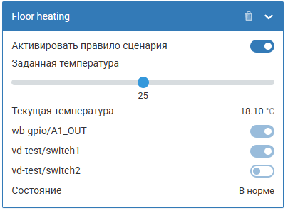
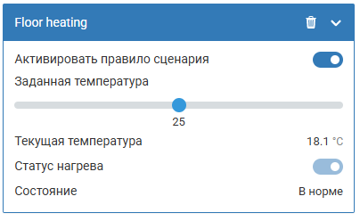

# Процесс разработки сценария

Данный документ описывает пошаговый процесс создания новых сценариев для WB с нуля.

## Общие принципы

При разработке сценариев важно следовать единой архитектуре, основанной на ScenarioBase. Подробнее об архитектуре см. [architecture-guide.md](architecture-guide.md).

### Требования к стилю кода

- **Файлы**: именовать kebab-case `custom-file.js`
- **Переменные в JSON/JS**: camelCase `customVar`
- **Строки в JS**: использовать одинарные кавычки `'text'` вместо `"`
- **JS код**: следовать стилю [Airbnb ES5](https://github.com/airbnb/javascript/tree/es5-deprecated/es5)
- **Форматирование**: обязательно использовать Prettier
- **Линтинг**: желательно использовать ESLint

## Этапы разработки нового сценария

Разработка нового сценария состоит из четырёх этапов. Подробный пример с полным кодом — в [example-add-new-scenario.md](example-add-new-scenario.md).

### 1. Хардкод логики сценария

- Создаём папку сценария: `mkdir scenarios/your-scenario-name`
- Создаём модуль сценария (`your-scenario.mod.js`) с бизнес-логикой
- Используем дефолтные значения вместо конфигурации
- Проверяем что логика работает на контроллере

> Этот этап необязателен при использовании AI-ассистента — можно сразу переходить к схеме.

### 2. Создание JSON-схемы

- Добавляем описание сценария в `definitions` файла `schema/wb-scenarios.schema.json`
- Добавляем ссылку в `oneOf`
- Добавляем переводы
- Проверяем отображение в веб-интерфейсе и корректность сохранения конфигурации

Имена параметров — только camelCase (`idPrefix`, не `id_prefix`). Эти имена превращаются в переменные внутри JS-кода.

### 3. Объединение схемы и логики

- Создаём модуль инициализации (`scenario-init-your-scenario.mod.js`)
- Подключаем конфигурацию из схемы к модулю сценария
- Подключаем в `scenarios/scenario-init-main.js`

### 4. Тестирование

- Проверяем полный цикл: конфигурация → инициализация → работа сценария
- Тестируем edge-cases и обработку ошибок

### Тестирование и отладка

#### 4.1. Базовое тестирование
1. Установить сценарий на контроллер
2. Создать конфигурацию через веб-интерфейс
3. Проверить создание виртуального устройства
4. Протестировать базовую функциональность

#### 4.2. Отладка

**Использование логера проекта**
В проекте используется унифицированная система логирования через модуль `logger.mod.js`. Рекомендуется использовать её вместо стандартного `log`:

```javascript
// Подключение логера
var Logger = require('logger.mod').Logger;
var logger = new Logger('YourScenario'); // Имя компонента для логов

// Использование различных уровней логирования
logger.debug('debug');
logger.info('info');

// Примеры логирования в сценарии
YourScenario.prototype.initSpecific = function(name, cfg) {
  logger.info('Initializing scenario: ' + name);
  logger.debug('Configuration: ' + JSON.stringify(cfg));
  
  try {
    // Логика инициализации
    logger.info('Scenario initialized successfully');
    return true;
  } catch (error) {
    logger.error('Failed to initialize scenario: ' + error.message);
    return false;
  }
};
```

**Общие рекомендации по отладке:**
- Использовать структурированное логирование для отслеживания выполнения
- Проверить состояние сценария через виртуальное устройство
- Тестировать различные сценарии ошибок
- Проверить обработку некорректных конфигураций

## Лучшие практики

### Разработка
1. **Итеративный подход**: начинайте с простой версии, постепенно усложняйте
2. **Тестирование**: тестируйте каждый этап разработки
3. **Логирование**: добавляйте подробные логи для отладки
4. **Валидация**: тщательно проверяйте входные данные

### Архитектура
1. **Следуйте ScenarioBase**: не изобретайте велосипед
2. **Разделяйте ответственность**: модуль сценария vs модуль инициализации
3. **Используйте состояния**: активно управляйте состоянием сценария
4. **Обрабатывайте ошибки**: предусматривайте все возможные сбои

### Дизайн виртуального устройства

Когда сценарий управляет несколькими связанными контролами (например, несколько каналов нагрева), предпочитайте один совокупный контрол вместо отображения каждого канала отдельно. Это упрощает восприятие и не перегружает интерфейс деталями, которые пользователю не нужны.

- **Антипаттерн** — отдельный контрол на каждый канал:

  

- **Рекомендация** — один общий статус:

  

### Код
1. **Читаемость**: пишите понятный код с комментариями
2. **Производительность**: избегайте тяжелых операций в обработчиках
3. **Совместимость**: учитывайте различные версии устройств WB
4. **Безопасность**: валидируйте все входные данные
