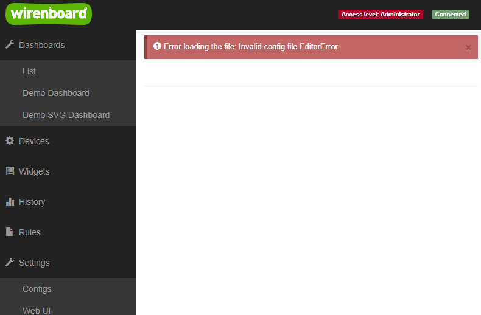

# Пример добавления сценария

***ВНИМАНИЕ:***
В процессе создания нового сценария вы можете испортить файл конфигурации
уже имеющихся сценариев - поэтому ОБЯЗАТЕЛЬНО сделайте копию работающего
конфиг файла!

Цель данного мануала - предоставить пример добавления базового простого сценария,
на основе которого можно создать свой кастомный изменив его логику работы.

## Связанная документация

Данный файл является практическим примером. Для полного понимания процесса разработки рекомендуется изучить:

- **[Архитектура сценариев](architecture-guide.md)** - подробная информация о базовой архитектуре ScenarioBase
- **[Процесс разработки сценария](development-process.md)** - различные подходы к разработке и лучшие практики
- **[Окружение разработчика](environment-guide.md)** - настройка линтеров, форматтеров и стиля кода

## Структура проекта

Структура проекта сценариев предполагает что файлы каждого сценария находятся
в подпапках каталога `scenarios`. Поэтому для нового сценария нужно создать
отдельную папку, например `scenarios/link-in-to-out`. Важно что имена файлов
и папок нужно писать через тире кебаб кейсом.

**Важно:** Директория `scenarios` и её подпапки имеют смысл только для 
разработки в репозитории. На контроллере файлы размещаются по другим путям:

- **Модули** размещаются в `/usr/share/wb-rules-modules/`
- **Модуль инициализации** подключается в `/usr/share/wb-rules-system/rules/scenario-init-main.js`
- **Схема** размещается в `/usr/share/wb-mqtt-confed/schemas/wb-scenarios.schema.json`

При разработке в репозитории используйте структуру:
- `scenarios/link-in-to-out/` - папка конкретного сценария
- `src/` - общие файлы для нескольких сценариев

## Этапы создания сценария

Архитектурно каждый сценарий должен иметь модуль который инициализирует работу
сценария, поэтому создание нового сценария разделено на несколько этапов:

- Добавляем в схему новый сценарий
- Создание дирректории нового сценария
- Создание модуля инициализации
- Создание модуля сценария
- Проверить работу базового сценария из примера
- Добавить свой кастомный фукнционал

## Стиль кода

Заранее обратим внимание на используемый стиль (подробнее см. [environment-guide.md](environment-guide.md)):

- Файлы нужно именовать кебаб кейсом `custom-file.js`
- Элементы и переменные внутри json и js файлов камел кейсом `customVar`
- Внутри js кода нужно использовать для строк одиночные скобки `'` а не `"`
- При программировании js нужно соответствоать стилю [Airbnb ES5](https://github.com/airbnb/javascript/tree/es5-deprecated/es5)  

## 1. Добавляем в схему новый сценарий

***Обратите внимание:***
Мы будем создавать сценарий с именем `linkInToOut` и положим
его в папку `scenarios\link-in-to-out`. Если вы хотите дать своему сценарию
другое имя - то можете сразу менять имена папок и переменных, чтобы
не возвращаться к этому потом. Иначе после создания сценария вам прийдется
довольно много менять в именах файлов и переменных.

### 1.1. Добавление описания

Ниже в примере описание сценария с именем 'linkInToOut' - именно это имя будет
искать скрипт инициализации который мы напишем на следующем шаге.

Обратите внимание на

- Имя сценаря - написано в первой строке `"linkInToOut": {`
  Имя должно быть уникальным

- Поле `componentVersion` - версия данного вида сценариев.
Данное поле важно для проверки пользовательского конфига перед началом работы.
Версию нужно инкрементировать каждый раз когда меняется структура конфигурации сценариев.

- Поле `scenarioType` - строка типа сценария, должна быть уникальной
  Скрытое поле которое добавляет в каждый созданный инстанс данного
  вида сценария его тип. Нужно для того чтобы при инициализации сценариев
  находить в массиве конфигураций нужные типы сценариев.
  Данное поле лучше делать таким же как название главной секции сценария,
  то есть - так как у нас в первой строке написоано `"linkInToOut": {` - то
  в поле `scenarioType` так же пишем linkInToOut.

- Открываем файл `schema\wb-scenarios.schema.json`

- Добавляем описание внутрь раздела `"definitions":`
  после последнего сценария:

```json
  "linkInToOut": {
    "type": "object",
    "title": "linkInToOutScenarioName",
    "description":"linkInToOutScenarioDescription",
    "_format": "grid",
    "properties": {
      "componentVersion": {
        "type": "integer",
        "title": "Config version",
        "minimum": 1,
        "maximum": 256,
        "default": 1,
        "options": {
          "hidden": true
        }
      },
      "scenarioType": {
        "type": "string",
        "enum": ["linkInToOut"],
        "default": "linkInToOut",
        "options": {
          "hidden": true
        }
      },
      "enable": {
        "type": "boolean",
        "title": "generalScenarioGenerateRuleTitle",
        "default": true,
        "_format": "checkbox",
        "propertyOrder": 1,
        "options": {
          "grid_columns": 12
        }
      },
      "name": {
        "type": "string",
        "title": "generalScenarioName",
        "default": "linkInToOutScenarioNameDefaultValue",
        "minLength": 1,
        "maxLength": 30,
        "propertyOrder": 2,
        "options": {
          "grid_columns": 12
        }
      },
      "id_prefix": {
        "type": "string",
        "title": "ID Prefix",
        "description": "id_prefix_description",
        "_pattern_comment": "Запрещает пробелы, /, +, и #, а также ограничивает строку использованием только цифр, нижнего подчеркивания и английских букв",
        "pattern": "^[0-9a-zA-Z_]+$",
        "default": "link_from_to",
        "minLength": 1,
        "maxLength": 15,
        "propertyOrder": 3,
        "options": {
          "grid_columns": 12,
          "patternmessage": "generalErrorRegexpPatternMessage"
        }
      },
      "inControl": {
        "type": "string",
        "_format": "wb-autocomplete",
        "title": "Input control",
        "description": "What input control we need use in format: device/control",
        "pattern": "^[^/+#]+/[^/+#]+$",
        "propertyOrder": 4,
        "options": {
          "grid_columns": 12,
          "wb": {
            "data": "devices"
          }
        },
        "minLength": 1
      },
      "inverseLink": {
        "type": "boolean",
        "title": "Inverse link behavior",
        "default": false,
        "_format": "checkbox",
        "propertyOrder": 5,
        "options": {
          "grid_columns": 12
        }
      },
      "outControl": {
        "type": "string",
        "_format": "wb-autocomplete",
        "title": "Output control",
        "description": "What output control we need use in format: device/control",
        "pattern": "^[^/+#]+/[^/+#]+$",
        "propertyOrder": 6,
        "options": {
          "grid_columns": 12,
          "wb": {
            "data": "devices"
          }
        },
        "minLength": 1
      }
    },
    "required": ["scenarioType", "enable", "name", "id_prefix"]
  },
```

### 1.2. Добавление в список сценариев

Для того чтобы сценарий появился в выпадающем списке - нужно добавить его
в definitions.scenario.oneOf[] вверху файла схемы:

```json
      "oneOf": [
        {
          "$ref": "#/definitions/devicesControl"
        },
        {
          "$ref": "#/definitions/lightControl"
        },
        {
          "$ref": "#/definitions/linkInToOut"
        }
      ],
```

### 1.3. Добавляем переводы

Переводы делать обязательно

Желательно делать это учитывая два момента

- Создавать промежуточное названия поля и уже это название использовать
  в переводе на английский и на русский
- Поле нужно называть начиная с названия сценария, например darkroom

Последовательность следующая:

- Полям присваиваем промежуточные условные названия, например
  Вместо:

  ```json
  "title": "Link in to out",
  "description":"Данный сценарий предоставляет возможность прямого соединения дискретного входа с дискретным выходом",
  ```

  Пишем:

  ```json
  "title": "linkInToOutScenarioName",
  "description":"linkInToOutScenarioDescription",
  ```

- В конце файла `schema\wb-scenarios.schema.json` находим `"translations": {`
  И внутри этого блока добавляем все переводы в "en" и "ru". Поля `"default"`
  строковых парметров не переводятся - поэтому там нужно написать текстом
  прямо в поле.

  Например:

  ```json
  "translations": {
    "en": {
      "linkInToOutScenarioName": "Link in to out",
      "linkInToOutScenarioDescription": "This scenario provides the ability to directly connect a discrete input to a discrete output"
    },
    "ru": {
      "linkInToOutScenarioName": "Связь входа с выходом",
      "linkInToOutScenarioDescription": "Данный сценарий предоставляет возможность прямого соединения дискретного входа с дискретным выходом"
    }
  ```

В итоге получаем более простое отслеживание наличия переводов полей
и при необходимости их измененение.

### 1.4. Создание конфиг файла

Данный пункт не актуален при создании дополнительного сценария - так как
конфиг уже был создан ранее по пути на контроллере `etc/wb-scenarios.conf`.

### 1.5. Проверка работы WEBUI

Проверка состоит из нескольких этапов:

- Открывается ли конфигуратор сценариев после изменении схемы

После того как вы внесли изменения в файл схемы есть вероятность что в файле
появились ошибки - если это так и синтаксис или структура файла были нарушены,
то при попытке открытия конфигуратора сценариев вы увидите ошибку.



Это может произойти, например при вставке одиного из блоков схемы в не
правильное место - что вызвало нарушение структуры файла.

- Проверяем отображается ли новый сценарий в выпадающем списке


- Смотрим как отображается WEBUI зайдя на страницу вашего сценария
  Здесь вы можете увидеть что не корректно работают переводы или вам что то
  не нравится в структуре отображаемого WEBUI, возможно вы поменяете тип
  отображения каких-то элементов на более удобные или заметите неточности или
  ошибки в тексте.

  Внешне созданный сценарий будет выглядеть следующим образом

  

- Попробовать сконфигурировать - проверив корректно ли работают проверки полей
- Сохранить файл - проверить что сохраняется и конфиг изменяется при ваших
  сохранениях в WEBUI.
- Проверить внутренности конфиг файла и его структуру - все ли вас устраивает.
  Например, вы можете заметить что некоторые элементы лучше упаковать
  в массив для дальнейшей более удобной обработки внутри кода правил.

Если вы все проверили и WEBUI корректно работает и создает конфиг со
удовлетворяющей вас структурой, то можно переходить к созданию
скрипта инициализации - который уже будет обрабатывать данный файл
конфигурации.

## 2. Создание дирректории нового сценария

Структура проекта сценариев предпологает что файлы каждого сценария находятся
в подпапках каталога `scenarios`. Поэтому для нового сценария нужно создать
отдельную папку, например `scenarios\link-in-to-out`. Важно что имена файлов
и папок нужно писать через тире кебаб кейсом.

Все файлы общие для нескольких сценариев нужно распологать в папке `src`.

## 3. Создание модуля инициализации

Архитектура инициализации сценариев построена на централизованном подходе:

1. **Главный файл инициализации** `scenarios/scenario-init-main.js` запускается 
   автоматически и подключает все модули инициализации сценариев.

2. **Модуль инициализации** для каждого типа сценария создается отдельно 
   и импортируется в главный файл.

### 3.1. Создание модуля инициализации

Для нового сценария нужно создать модуль инициализации, который будет:

- Открывать общий файл конфигурации сценариев
- Проверять версию конфига
- Выбирать все сценарии данного типа (например "linkInToOut")
- Фильтровать только активные сценарии (enable = true)
- Инициализировать каждый сценарий через его модуль

**Создаем файл:** `scenarios/link-in-to-out/scenario-init-link-in-to-out.mod.js`

**Полный код модуля инициализации:** [scenario-init-link-in-to-out.mod.js](scenario-init-link-in-to-out.mod.js)

Основные элементы кода:
- Импорт необходимых модулей (`scHelpers`, `LinkInToOutScenario`, `Logger`)
- Конфигурация CFG с параметрами инициализации
- Функция `initializeScenario()` для создания экземпляра сценария
- Функция `setup()` для загрузки и инициализации всех сценариев типа
- Обработка ошибок и логирование
- Сохранение сценариев в глобальном хранилище

**Глобальное хранилище сценариев**

Каждый инициализированный сценарий сохраняется в глобальном хранилище через:

```javascript
var scenarioStorage = scHelpers.getGlobalScenarioStore(CFG.scenarioTypeStr);
scenarioStorage[scenario.idPrefix] = scenario;
```

Это хранилище предназначено для:
- **Просмотра активных сценариев** из внешних скриптов без необходимости кастомного сбора информации
- **Потенциального управления сценариями** из других частей системы
- **Предотвращения дублирования** при попытке получить информацию о запущенных сценариях

**Важно:** В данный момент глобальное хранилище используется только для внешнего доступа к информации о сценариях. Сами сценарии его не используют для своей внутренней логики. В будущем эта функциональность может быть перенесена в базовый класс ScenarioBase.

### 3.2. Подключение к главному файлу

После создания модуля инициализации, его нужно подключить в файле 
`scenarios/scenario-init-main.js`, добавив импорт и вызов:

1. **Добавить импорт** в начало файла рядом с другими импортами:

```javascript
var setupDevicesControl = require("scenario-init-devices-control.mod").setup;
var setupLightControl = require("scenario-init-light-control.mod").setup;
var setupThermostat = require("scenario-init-thermostat.mod").setup;
var setupLinkInToOut = require("scenario-init-link-in-to-out.mod").setup;  // Добавить эту строку
```

2. **Добавить вызов** в функции `main()` после других вызовов setup:

```javascript
  runShellCommand(cmdList, {
    captureOutput: true,
    captureErrorOutput: true,
    exitCallback: function (exitCode, capturedOutput, capturedErrorOutput) {
      setupDevicesControl();
      setupLightControl();
      setupThermostat();
      setupLinkInToOut();  // Добавить эту строку
    }
  });
```

## 4. Создание модуля сценария

Модуль сценария строится на базе класса `ScenarioBase` из `wbsc-scenario-base.mod.js`, 
который предоставляет унифицированный интерфейс для всех сценариев.

### 4.1. Структура модуля

Модуль должен:

1) **Импортировать базовый класс** `ScenarioBase` и другие необходимые модули
2) **Создать класс сценария**, наследующий от `ScenarioBase`
3) **Реализовать метод инициализации** с созданием виртуального устройства
4) **Реализовать логику сценария** в обработчиках событий
5) **Экспортировать класс сценария** для использования в модуле инициализации

### 4.2. Преимущества использования ScenarioBase

- Унифицированное управление виртуальными устройствами
- Стандартизированная обработка ошибок и логирование
- Автоматическое управление жизненным циклом сценария
- Встроенная поддержка включения/отключения сценариев

**Создаем файл:** `scenarios/link-in-to-out/link-in-to-out.mod.js`

**Полный код модуля сценария:** [link-in-to-out.mod.js](link-in-to-out.mod.js)

Основные элементы кода:
- Класс `LinkInToOutScenario`, наследующий от `ScenarioBase`
- Метод `generateNames()` для создания уникальных имен виртуальных устройств и правил
- Метод `validateCfg()` для проверки корректности конфигурации
- Метод `defineControlsWaitConfig()` для настройки ожидания контролов
- Функция `createRules()` для создания правил wb-rules
- Функция `handleInputChange()` для обработки изменений входного контрола
- Метод `initSpecific()` для специфичной инициализации сценария

## 5. Проверить работу базового сценария

### 5.1. Выбор контролов которые можем использовать для проверки

  Созданный сценарий будет работать корректно только с контролами типа switch
  которые сохраняют свое состояние в переменной типа bool.

  Вы можете использовать для этого любое подходящее реальное устройство или
  для удобства можете создать файл скрипта с описанием двух простых
  виртуальных устройств `virtual-devices.js`

```javascript
var name_postfix;
var gen_vd_name;

name_postfix = "_1";
gen_vd_name = "vd_wall_switch" + name_postfix;

defineVirtualDevice(gen_vd_name, {
  title: {
    en: "Virt. wall switch" + name_postfix,
    ru: "Вирт. настенный выключатель" + name_postfix,
  },
  cells: {
    enabled: {
      title: "Статус выключателя" + name_postfix,
      type: "switch",
      value: false,
    },
  },
});

name_postfix = "_1";
gen_vd_name = "vd_pump" + name_postfix;

defineVirtualDevice(gen_vd_name, {
  title: {
    en: "Virt. pump" + name_postfix,
    ru: "Вирт. насос" + name_postfix,
  },
  cells: {
    enabled: {
      title: "Статус насоса" + name_postfix,
      type: "switch",
      value: false,
    },
  },
});
```

В итоге получим на странице девайсов два новых виртуальных девайса

- Выключатель


- Насос


### 5.2. Конфигурация сценария

Указываем, обязательно пользуясь автодополнением чтобы не допускать ошибок:

- В поле входа `vd_wall_switch_1/enabled`
- В поле выхода `vd_pump_1/enabled`

Сохраненяем и начинаем проверять

### 5.2. Проверка работоспособности

После создания всех файлов нужно проверить что все работает так как задумано.

1) Проверка прямого копирования:

- Заходим на страницу виртуальных девайсов
- Кликаем на выключатель
- Проверяем что состояние насоса так же переключается в соотсветствии
  с настройками сценария

2) Проверка инверсного копирования:

- Ставим галочку для инверсии в сценарии
- Повторно проверяем что теперь поведение сценария изменилось

3) Проверка приостановки работы правила:

- В виртуальном девайсе сценария (не в настройках сценария) отключаем
  его работу галочкой
- Проверяем что копирование состояний прекратилось

4) Проверка деактивации сценария:

- Заходим в настройки сценария (не в виртуальном девайсе)
  и устанавливаем галочку активации сценария
- Сохраняем
- Переходим на страницу виртуальных девайсов и проверяем что виртуальное
  устройство удалилось - это означает что ни виртуальное устройство
  ни правило теперь не создаются

Поздравляем - вы создали свой первый сценарий!

## 6. Добавить документацию

1) Создать README файл для нового сценария по пути
   `scenarios\link-in-to-out\README.md`
   Описание должно содержать:
   - Внешний вид конфигуратора созданного сценария
   - Тонкости работы сценария, его логики и тд
2) Добавить в общий README файл ссылку на реализованный  сценарий
   - Открыть файл `README.md` находящийся в корне проекта
   - Добавить в список реализованных сценариев ссылку на файл README
     конкрентного сценария созданный выше

## 7. Добавить свой кастомный фукнционал

Теперь, когда реализован работающий минимальный сценарий - его можно изменять
и добавлять тот фунцкионал который нужен именно вам.

Например если вы хотите добавить новую калочку в настройку сценария,
то это можно сделать начав с добавления в WEBUI и прокинуть до модуля:

1) Добавить галочку в файл схемы
2) Добавить новое поле в скрипте инициализации, чтобы оно передавалось
  в функцию init() внутрь модуля
3) Прокинуть в модуль новые поля, для этого внутри файла модуля:
   - В export добавить новое поле
   - Добавить новое поле в параметры самой функции init()
4) В модуле реализовать функционал использующий данные поля

## 8. Переименование

После того как вы в первый раз создали свой сценарий - можно переименовать
его.

Переименование довольно обширное, поэтому будьте осторожны,
не забудьте поменять:

1) Внутри схемы:
   - Ссылка внутри `"oneOf"`
   `"$ref": "#/definitions/linkInToOut"` -> `"$ref": "#/definitions/thermostat"`

   - Название - корневой элемент схемы сценария
   `"linkInToOut": {` -> `"thermostat": {`

   - Элементы схемы сценария в имени которых содержится старое название
   `linkInToOut` -> `<!customName!>`, например `thermostat`
  
   - Переводы

2) Проверить работу WEBUI и пофиксить конфиг

  Если вы ранее уже сконфигурировали какие-то сценарии, то после
  переименования элементов схемы - у вас перестанет открываться конфигуратор.
  Вы увидете ошибку:

  ```text
  Ошибка загрузки файла: Invalid config file EditorError
  ```

  Для решения этой проблеммы вам нужно привести файл конфигурации
  в соответствие с новой схемой. Это можно сделать тремя способами

- Радикально и быстро не разбираясь удалить все настройки сценариев внутри
  массива "scenarios": []
- Удалить только те сценарии из файла конфига которые были изменены
- Точечно переименовать все поля внутри конфига так, чтобы они
  соответствоали новым полям в схеме.  

3) Папку сценария
  `scenarios\link-in-to-out` -> `scenarios\<!custom-name!>`

4) Файл модуля инициализации

   - Имя файла:
   `scenario-init-link-in-to-out.mod.js` -> `scenario-init-<!custom-name!>.mod.js`
   
   - Подключение в главном файле:
   Обновить импорт в `scenarios/scenario-init-main.js`

В простом случае - для модификации файла под новый сценарий достаточно сделать
три действия (Помечены в коде комментарием вида `//@todo:Change X`):

- Поменяйте автора в верхнем комментарии

  ```javascript
   * @author Ivan Ivanov <ivan.ivanov@wirenboard.com>
  ```

- Установить тип строки сценария в переменную `SCENARIO_TYPE_STR`
  `var SCENARIO_TYPE_STR = 'linkInToOut';` -> `... = '<!customName!>';`
  Например:

  ```javascript
  var SCENARIO_TYPE_STR = 'darkroom';
  ```

- При подключении модуля в scenario-init-....mod.js поправить имя модуля и имя класса

  ```javascript
  var linkInToOut = require('link-in-to-out.mod');
  ```

- Внутри функции `initializeScenario()` поправить создание экзепляра и обновить структуру `cfg` объекта так чтобы параметры отражали структуру вашей схемы

  ```javascript
  var isInitSucess = darkroom.init(scenario.id_prefix,
                                  scenario.name,
                                  ... custom parameters ...)
  ```

5) Файл модуля

   - Имя файла:
   `link-in-to-out.mod.js` -> `<!custom-name!>.mod.js`

6) И другие элементы которые имеют старое имя ...
