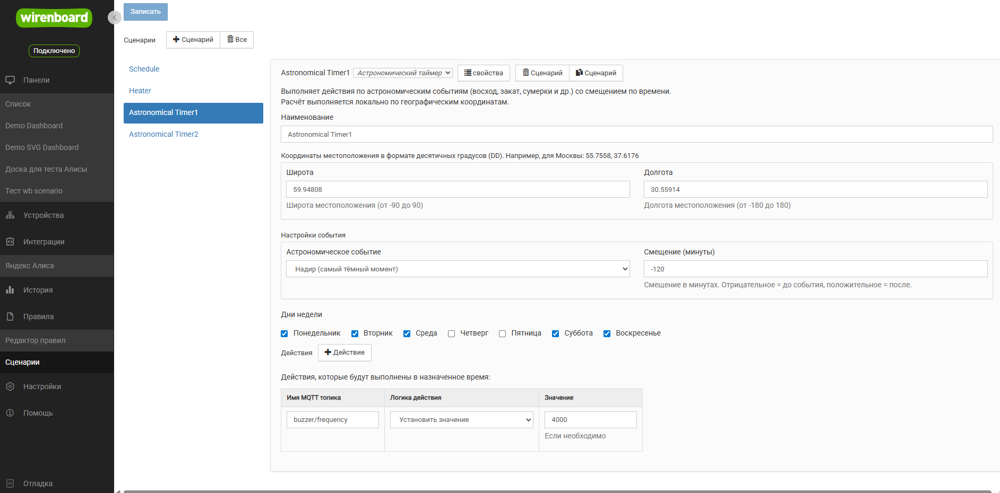
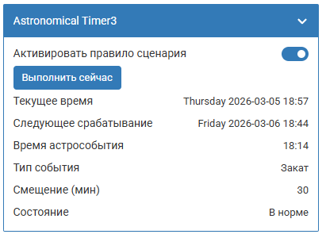

# Сценарий астрономического таймера `astronomicalTimer`

## Общее описание

Данный сценарий позволяет автоматически выполнять набор действий в зависимости от астрономических событий (восход, закат, рассвет, сумерки и т.д.) с возможностью смещения времени. Идеально подходит для:

- Управления освещением по световому дню
- Автоматизации жалюзи или штор по времени восхода/заката
- Включения уличного освещения с наступлением сумерек
- Сезонной автоматизации, привязанной к длине светового дня

**Важное замечание о местоположении:** Данный сценарий использует географические координаты для расчета времени восхода, заката и других астрономических событий. Убедитесь, что координаты указаны правильно, иначе время событий будет рассчитано неверно.

**О часовых поясах:** Сценарий работает, опираясь на **системное время** и **часовой пояс**, установленные на контроллере. При смене часового пояса необходимо перезапустить wb-rules:

```shell
$ service wb-rules restart
```

Если не перезапустить сервис, то время wb-rules продолжит использовать старый часовой пояс для старых и вновь создаваемых сценариев!

Конфигуратор сценария выглядит следующим образом:

<p align="center">
    
</p>

## Логика работы

Сценарий использует библиотеку SunCalc для локального расчета астрономических событий на основе географических координат:

1. **Автоматическое выполнение:**
   - Расчет времени события для каждого проверяемого дня
   - Применение смещения (offset) в минутах
   - Проверка каждую минуту (cron: `0 * * * * *`)
   - **Определение фактического дня недели после применения смещения**
   - Выполнение действий при наступлении рассчитанного времени **только если фактический день недели разрешен**
   - Автоматический пересчет при смене дня, часового пояса или параметров конфигурации

2. **Ручное выполнение:**
   - Кнопка "Execute now" в виртуальном устройстве
   - Немедленное выполнение всех настроенных действий
   - Не влияет на автоматическое расписание

3. **Кэширование результатов:**
   - Время события сохраняется вместе с параметрами конфигурации в контекст
   - Пересчет происходит только при изменении даты, часового пояса, типа события, смещения, координат или дней недели
   - Экономит вычислительные ресурсы контроллера

4. **Отображение информации:**
   - Текущее время системы
   - Тип астрономического события (с локализацией)
   - Время следующего выполнения с учетом всех параметров
   - Исходное время астрособытия (отображается только при offset ≠ 0)
   - Величина смещения в минутах (отображается только при offset ≠ 0)

## Параметры конфигурации

### Координаты (coordinates)

Объект, содержащий географические координаты места:

- **latitude** (number): Географическая широта в градусах (от -89.9 до 89.9)
  - Положительные значения - северная широта
  - Отрицательные значения - южная широта
  - Ограничение ±89.9° — безопасный порог для SunCalc (±90° вызывает ошибки)

- **longitude** (number): Географическая долгота в градусах (от -180 до 180)
  - Положительные значения - восточная долгота
  - Отрицательные значения - западная долгота

### Настройки события (eventSettings)

- **astroEvent** (string): Тип астрономического события
  - `sunrise` - Восход солнца
  - `sunset` - Закат солнца
  - `dawn` - Рассвет (утренние сумерки)
  - `dusk` - Сумерки (вечерние)
  - `nauticalDawn` - Навигационный рассвет
  - `nauticalDusk` - Навигационные сумерки
  - `nightEnd` - Конец ночи (астрономический рассвет)
  - `night` - Ночь (астрономические сумерки)
  - `goldenHour` - Золотой час (утренний)
  - `goldenHourEnd` - Конец золотого часа (вечерний)
  - `solarNoon` - Солнечный полдень
  - `nadir` - Надир (солнечная полночь)

- **offset** (number): Смещение в минутах (от -720 до 720)
  - Положительные значения - сдвиг события вперед (позже)
  - Отрицательные значения - сдвиг события назад (раньше)
  - Пример: offset = 30 для sunset даст выполнение через 30 минут после заката

### Дни недели (scheduleDaysOfWeek)

Массив дней недели, когда сценарий должен выполняться:

- **scheduleDaysOfWeek** (array): ["monday", "tuesday", "wednesday", "thursday", "friday", "saturday", "sunday"]

**Важно:** Проверка дней недели выполняется **после** применения смещения. Это означает, что если смещение переносит событие на другой день, то проверяется именно этот фактический день.

### Действия (outControls)

Действия полностью соответствуют структуре сценария `devices-control`:

- **behaviorType** (string): Тип поведения из `table-handling-actions.mod.js`
- **control** (string): Имя контрола в формате "device/control"
- **actionValue** (mixed): Значение для типов setValue, increaseValueBy, decreaseValueBy

## Пример конфигурации

### Объект JSON для редактора

```json
{
  "enable": true,
  "name": "Управление светом по закату",
  "coordinates": {
    "latitude": 55.7558,
    "longitude": 37.6173
  },
  "eventSettings": {
    "astroEvent": "sunset",
    "offset": 30
  },
  "scheduleDaysOfWeek": [
    "monday",
    "tuesday",
    "wednesday",
    "thursday",
    "friday"
  ],
  "outControls": [
    {
      "actionValue": 1,
      "behaviorType": "setEnable",
      "control": "lights/garden/switch"
    }
  ]
}
```

### Конфигурация записанная в файле \*.conf

```json
{
  "configVersion": 1,
  "scenarios": [
    {
      "componentVersion": 1,
      "enable": true,
      "name": "Уличное освещение",
      "coordinates": {
        "latitude": 55.7558,
        "longitude": 37.6173
      },
      "eventSettings": {
        "astroEvent": "dusk",
        "offset": 0
      },
      "scheduleDaysOfWeek": [
        "monday",
        "tuesday",
        "wednesday",
        "thursday",
        "friday",
        "saturday",
        "sunday"
      ],
      "outControls": [
        {
          "actionValue": 1,
          "behaviorType": "setEnable",
          "control": "outdoor_lighting/switch"
        }
      ]
    }
  ]
}
```

## Виртуальное устройство

Сценарий создает виртуальное устройство с контролами:

- **Execute now** (pushbutton): Кнопка для немедленного выполнения действий
- **Current time** (text): Отображение текущего времени системы, подтягивается из wb-rules-system
- **Next execution** (text): Время следующего выполнения с учетом смещения
- **Astronomical event time** (text): Исходное время астрособытия (отображается только при offset ≠ 0)
- **Event type** (text): Тип астрономического события с локализованным названием
- **Offset** (text): Величина смещения в минутах (отображается только при offset ≠ 0)

### Внешний вид

Создаваемое сценарием виртуальное устройство выглядит следующим образом:

<p align="center">
    
</p>

## Особенности использования

1. **Географические координаты:** Для точности расчета используйте координаты места установки контроллера или объекта автоматизации. Координаты можно получить через Google Maps или аналогичные сервисы.

2. **Смещение (offset)**: Позволяет гибко настраивать время выполнения относительно астрособытия. Например, включить свет за 30 минут до заката (offset = -30) или выключить через 15 минут после восхода (offset = 15).

3. **Полярный день/ночь**: В высоких широтах некоторые астрономические события могут не наступать в определенные периоды (полярный день/ночь). Сценарий автоматически ищет ближайшее доступное событие в пределах 365 дней. Например, для Шпицбергена (78°N) событие `nightEnd` может быть найдено через ~209 дней.

4. **Дни недели и смещение**: Проверка дней недели выполняется после применения смещения. Это важно помнить при настройке: например, событие "надир" с отрицательным смещением может фактически произойти в предыдущий день, и именно этот день будет проверяться на соответствие расписанию.

5. **Действия**: Структура действий полностью совместима с сценарием devices-control. Вы можете копировать массив outControls из других сценариев.

6. **Кэширование**: Для оптимизации производительности время следующего срабатывания кэшируется и пересчитывается только при смене дня, часового пояса, типа события, смещения, координат или дней недели.

7. **Системное время**: Сценарий использует системное время контроллера. Убедитесь в правильной настройке часового пояса и синхронизации времени (NTP).

## Ограничения

1. **Точность выполнения**: Проверка времени происходит каждую минуту, поэтому фактическое выполнение может происходить с задержкой до 60 секунд

2. **Географические ограничения**: Широта ограничена диапазоном ±89.9°. В приполярных областях некоторые события могут отсутствовать в определенные сезоны (поиск ведётся до 365 дней вперёд)

3. **Производительность**: Не рекомендуется создавать большое количество астрономических таймеров (более 20-30) на одном контроллере

## Использование модуля

Вы можете использовать модуль астрономический таймер прямо из своих
правил `wb-rules`. Для этого нужно сделать 4 шага:

1. Импортировать класс кастомного сценария
2. Создать новый инстанс класса "Астрономический таймер"
3. Создать объект настроек где прописать требуемые значения:
   - координаты
   - настройки события
   - дни запуска события
4. Инициализировать алгоритм указав:
   - Имя виртуального устройства
   - Созданный объект конфигурации

### Описание параметров конфигурации

Конфигурация имеет 6 параметров, из которых 1 необязательный.

AstronomicalTimerConfig:

1. `idPrefix` {string} Не обязательный параметр
   Задает строку префикса добавляемого к идентификаторам
   виртуального устройства и правил:
   - Если параметр указан, то вирт. устройство и правила будут иметь
     имена вида wbsc*<!idPrefix!>, wbsc*<!idPrefix!\_mainRule, и т.д.
   - Если не указан (undefined), то правая часть создается методом
     транслитерации из имени переданного в init()
2. `coordinates` {object} Объект с географическими координатами
   Содержит два обязательных поля:
   - `latitude` {number} Географическая широта в градусах (от -89.9 до 89.9)
     Положительные значения - северная широта, отрицательные - южная
   - `longitude` {number} Географическая долгота в градусах (от -180 до 180)
     Положительные значения - восточная долгота, отрицательные - западная
3. `eventSettings` {object} Объект настроек астрономического события
   Содержит два обязательных поля:
   - `astroEvent` {string} Тип астрономического события
     Возможные значения: "sunrise", "sunset", "dawn", "dusk",
     "nauticalDawn", "nauticalDusk", "nightEnd", "night",
     "goldenHour", "goldenHourEnd", "solarNoon", "nadir"
   - `offset` {number} Смещение в минутах (от -720 до 720)
     Положительные значения сдвигают событие вперед (позже),
     отрицательные - назад (раньше)
4. `scheduleDaysOfWeek` {array} Массив дней недели для выполнения
   Возможные значения: "monday", "tuesday", "wednesday", "thursday",
   "friday", "saturday", "sunday".
   - Важно: Проверка дней недели выполняется после применения смещения.
     Если offset переносит событие на другой день, проверяется именно этот
     фактический день.
5. `outControls` {array} Массив управляющих воздействий
   Каждый элемент массива содержит объект с полями:
   - `control` {string} Имя контрола в формате "device/control"
     Пример: 'lights/garden/switch'
   - `behaviorType` {string} Тип поведения из table-handling-actions.mod.js
     Возможные значения: "setEnable", "setDisable", "setValue", "toggle",
     "increaseValueBy", "decreaseValueBy", "press", "hold", "release"
   - `actionValue` {mixed} Значение для типов setValue, increaseValueBy, decreaseValueBy
     Для setEnable/setDisable используется булево значение (true/false)
     Для increaseValueBy/decreaseValueBy используется число

### Пример кода

```js
/**
 * @file: init-astro-lighting.js
 */

// Step 1: import module
var CustomTypeSc =
  require('astronomical-timer.mod').AstronomicalTimerScenario;

function main() {
  var scenarioName = 'Garden lights by sunset';
  log.debug('Start init logic for: "{}"', scenarioName);

  // Step 2: Create new instance with scenario class
  var scenario = new CustomTypeSc();

  // Step 3: Configure algorithm
  var cfg = {
    idPrefix: 'garden_sunset', // Не обязательный параметр, можно не указывать
    coordinates: {
      latitude: 55.7558,
      longitude: 37.6173,
    },
    eventSettings: {
      astroEvent: 'sunset',
      offset: 30, // Через 30 минут после заката
    },
    scheduleDaysOfWeek: [
      'monday',
      'tuesday',
      'wednesday',
      'thursday',
      'friday',
      'saturday',
      'sunday',
    ],
    outControls: [
      {
        control: 'lights/garden/switch',
        behaviorType: 'setEnable',
      },
    ],
  };

  // Step 4: init algorithm
  try {
    var isInitSuccess = scenario.init(scenarioName, cfg);

    if (!isInitSuccess) {
      log.error('Init operation aborted for scenario: "{}"', scenarioName);
      return;
    }

    log.debug('Initialization successful for: "{}"', scenarioName);
  } catch (error) {
    log.error(
      'Exception during scenario initialization: "{}" for scenario: "{}"',
      error.message || error,
      scenarioName
    );
  }
}

main();
```

После запуска скрипта у вас в устройствах появится новое устройство - которое будет аналогично тому, что вы можете создать через визульный конфигуратор в WEBUI контроллера:

<p align="center">
    
</p>
