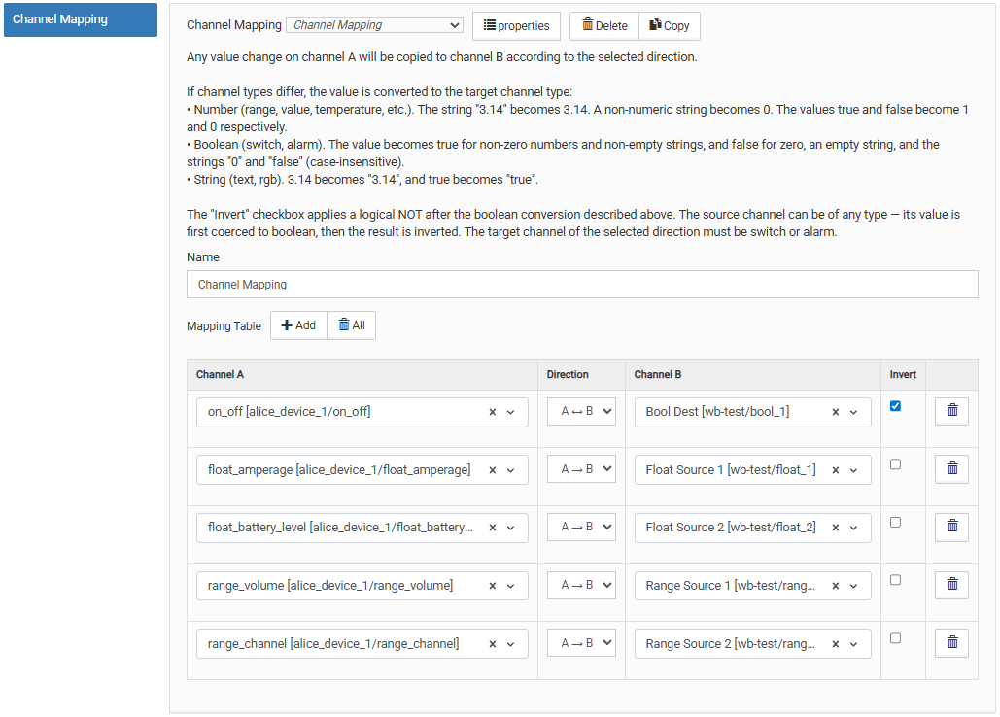
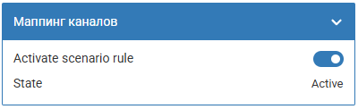

# Сценарий маппинга каналов `channelMap`

## Общее описание

Сценарий создаёт программные связи между MQTT-каналами (controls).
При изменении значения канала A оно автоматически копируется в канал B
согласно выбранному направлению.

Типичные применения:

- Программная привязка выключателя к реле (вместо аппаратной)
- Зеркалирование показаний датчика на панель или дисплей
- Прокидывание значений между устройствами разных протоколов
  (Zigbee → Modbus)

Конфигуратор сценария выглядит следующим образом:

<p align="center">
    
</p>

## Логика работы

### Связки (mqttTopicsLinks)

Сценарий содержит массив связок, каждая из которых определяет пару
каналов A и B с заданным направлением:

- `forward` — копирование A → B
- `backward` — копирование B → A
- `both` — двустороннее копирование A ↔ B

Несколько связок могут иметь один и тот же канал в роли источника —
все соответствующие целевые каналы получат значение одновременно.

### Проверка типов

При инициализации сценарий сравнивает типы каналов A и B.
Если типы отличаются — в лог пишется предупреждение (warning)
и на виртуальном устройстве появляется индикатор.
Сценарий при этом продолжает работать.

### Защита от петель

- **Прямая петля** (канал A === канал B) — связка отклоняется
  при валидации, сценарий не инициализируется
- **Непрямая петля** (A→B и B→A) — разрешена, полезна для
  двусторонней синхронизации
- **Дубликаты и перекрытия** — если одна и та же пара каналов
  указана несколько раз, в лог пишется предупреждение:
  - `both` покрывает ранее заданный `forward` или `backward`
  - повторная связка с тем же направлением — дубликат
  - при перевёрнутом порядке каналов (A/B и B/A) направление
    нормализуется для корректного сравнения
- Кросс-сценарные петли не проверяются — ответственность пользователя

### Поддержка pushbutton

Контролы типа `pushbutton` — кнопки без состояния (stateless),
значение всегда `1`. Для них стандартная проверка
`текущее !== новое` не работает: после первого нажатия значение
уже `1` и повторные нажатия не проходят.

Для предотвращения бесконечных петель между pushbutton-контролами
используется механизм счётчика каскадов (cascade counter):
каждое пользовательское нажатие — новый «каскад». Все записи
в рамках одного каскада помечаются одним ID. Если контрол уже
помечен текущим каскадом — повторная запись пропускается.

Это корректно работает для всех топологий: пар, цепочек,
полносвязных графов и циклов.

### Состояние (`state`)

| Значение     | Описание                                   |
| ------------ | ------------------------------------------ |
| **Активен**  | Включён, все контролы доступны             |
| **Отключен** | Сценарий выключен (`rule_enabled = false`) |

При наличии некорректных связок (несовпадение типов или min/max)
на виртуальном устройстве появляется отдельный контрол `warning`
с предупреждением. Состояние при этом остаётся «Активен».

---

## Параметры конфигурации

### Наименование (`name`)

Имя сценария, используется как заголовок виртуального устройства.
Максимум 30 символов.

### Префикс идентификатора (`idPrefix`)

Не обязательный параметр. Технический префикс для MQTT-имён
виртуального устройства и правил. Максимум 15 символов,
допустимы латинские буквы, цифры и `_`. Если не указан,
генерируется автоматически транслитерацией из имени сценария.

### Связки (`mqttTopicsLinks`)

Массив связок. Минимум 1 элемент.

| Поле         | Тип    | Описание                                   |
| ------------ | ------ | ------------------------------------------ |
| `mqttTopicA` | string | Топик канала A: `устройство/контрол`       |
| `direction`  | string | Направление: `forward`, `backward`, `both` |
| `mqttTopicB` | string | Топик канала B: `устройство/контрол`       |

---

## Пример конфигурации

### Привязка выключателя к реле

```json
{
  "scenarioType": "channelMap",
  "componentVersion": 1,
  "name": "Выключатель → Реле",
  "mqttTopicsLinks": [
    {
      "mqttTopicA": "wb-gpio/A1_OUT",
      "direction": "forward",
      "mqttTopicB": "wb-gpio/A2_OUT"
    }
  ]
}
```

### Двусторонняя синхронизация

```json
{
  "scenarioType": "channelMap",
  "componentVersion": 1,
  "name": "Двусторонняя синхронизация",
  "mqttTopicsLinks": [
    {
      "mqttTopicA": "zigbee/switch",
      "direction": "both",
      "mqttTopicB": "modbus/relay"
    }
  ]
}
```

### Зеркалирование датчика на несколько приёмников

```json
{
  "scenarioType": "channelMap",
  "componentVersion": 1,
  "name": "Датчик на панель",
  "mqttTopicsLinks": [
    {
      "mqttTopicA": "wb-msw-v4_34/Temperature",
      "direction": "forward",
      "mqttTopicB": "panel/display_temp"
    },
    {
      "mqttTopicA": "wb-msw-v4_34/Humidity",
      "direction": "forward",
      "mqttTopicB": "panel/display_hum"
    }
  ]
}
```

---

## Виртуальное устройство

Сценарий создаёт виртуальное устройство `wbsc_<idPrefix>` с контролами:

| Контрол        | Тип    | Описание                                      |
| -------------- | ------ | --------------------------------------------- |
| `rule_enabled` | switch | Включение/выключение сценария                 |
| `state`        | value  | Состояние: «Активен» / «Ожидает» / «Отключен» |
| `warning`      | text   | Отображается при некорректных связях          |

### Внешний вид

Создаваемое сценарием виртуальное устройство выглядит следующим образом:

<p align="center">
    
</p>

---

## Особенности использования

1. **Readonly целевой канал:** запись в readonly-контролы виртуальных
   устройств wb-rules работает без ошибок. Readonly блокирует только
   изменение через UI, программная запись проходит штатно.

2. **Перезапуск wb-rules:** при перезапуске сценарий переинициализируется,
   подписки восстанавливаются автоматически.

3. **Частые изменения источника:** каждое изменение приводит к копированию.
   Throttle не применяется — это ожидаемое поведение.

4. **Предупреждения о несовместимости:** при несовпадении типов
   или ограничений min/max на виртуальном устройстве загорается
   красный индикатор `warning`, а в лог пишется предупреждение.
   Сценарий продолжает работать, но рекомендуется проверить настройки.

---

## Ограничения

1. **Только копирование:** версия 1 поддерживает только прямое
   копирование значений без трансформаций (масштабирование, инверсия
   и т.п.).

2. **Кросс-сценарные петли:** петли между разными сценариями
   не обнаруживаются — ответственность пользователя.

3. **Pushbutton и ожидание контролов:** контролы типа `pushbutton`
   не публикуют retained-значение при создании. Если pushbutton
   ни разу не был нажат, сценарий ожидает появления значения
   до 60 секунд (таймаут `defineControlsWaitConfig`).

---

## Использование модуля

Вы можете использовать модуль виртуальной связки напрямую из своих
правил `wb-rules`. Для этого нужно сделать 4 шага:

1. Импортировать класс `ChannelMapScenario`
2. Создать новый экземпляр класса
3. Создать объект настроек
4. Инициализировать сценарий, передав имя и конфигурацию

### Параметры конфигурации

`ChannelMapConfig`:

1. `idPrefix` {string} — необязательный. Префикс MQTT-имён виртуального
   устройства и правил. Если не указан, генерируется транслитерацией из имени.
2. `mqttTopicsLinks` {array} — массив связок. Минимум 1 элемент. Каждый элемент:
   - `mqttTopicA` {string}: топик канала A `'device/control'`
   - `direction` {string}: направление `'forward'`, `'backward'`, или `'both'`
   - `mqttTopicB` {string}: топик канала B `'device/control'`

### Пример кода

```js
/**
 * @file: init-channel-mapping.js
 */

// Step 1: import module
var CustomTypeSc = require('channel-map.mod').ChannelMapScenario;

function main() {
  var scenarioName = 'Switch to relay';

  // Step 2: create instance
  var scenario = new CustomTypeSc();

  // Step 3: configuration
  var cfg = {
    idPrefix: 'switch_relay',
    mqttTopicsLinks: [
      {
        mqttTopicA: 'wb-gpio/A1_OUT',
        direction: 'forward',
        mqttTopicB: 'wb-gpio/A2_OUT',
      },
    ],
  };

  // Step 4: init algorithm
  try {
    var isInitSuccess = scenario.init(scenarioName, cfg);

    if (!isInitSuccess) {
      log.error('Init failed for: "{}"', scenarioName);
      return;
    }

    log.debug('Init successful for: "{}"', scenarioName);
  } catch (error) {
    log.error(
      'Exception during init: "{}" for: "{}"',
      error.message || error,
      scenarioName
    );
  }
}

main();
```
