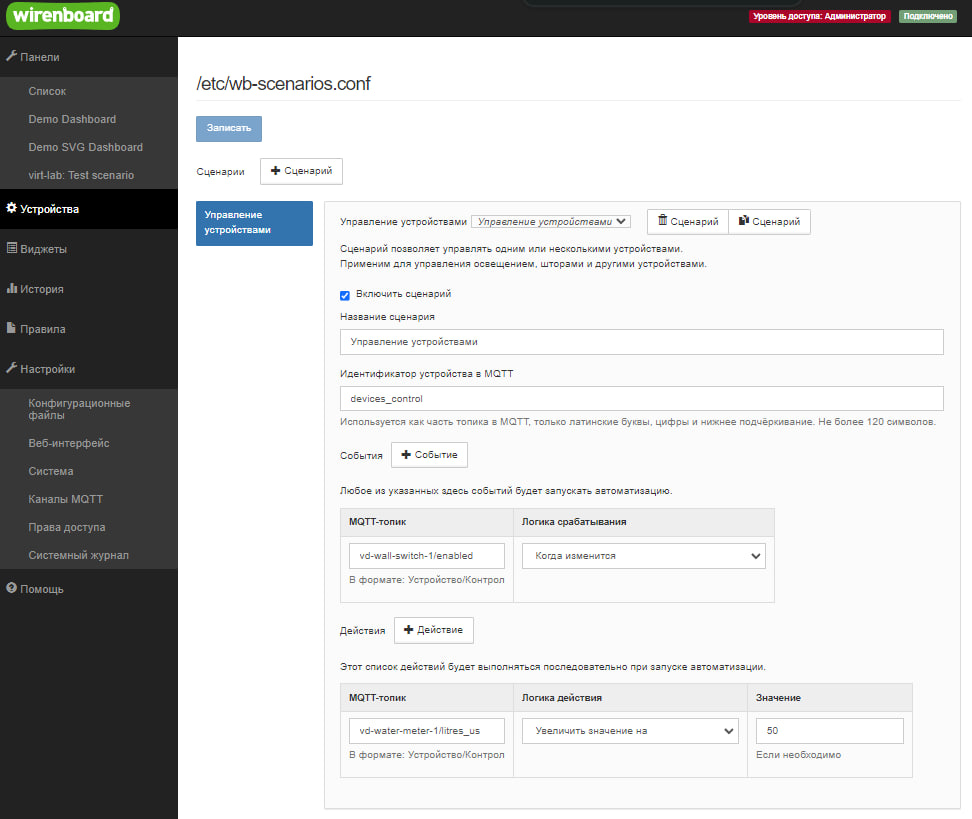
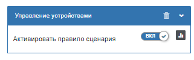

# Сценарий управления устройствами `devices-control`

Позволяет управлять светом соединив один или несколько выключателей с одним или несколькими световыми приборами
Удобен для реализации разных случаев:

- Мастер выключателя - один выключатель выключает весь свет в помешениях
- Проходной выключатель - несколько выключателей управляют одним световым прибором
- Управление шторами

Конфигурация выглядит следующим образом

Каждому сценарию создается виртуальное устройство

## Добавление новых типов операций

В сценарии используются следующие термины описанные ниже

### События и действия

В сценарии есть два типа сущностей которые конфигурирует пользователь

- Событие (event) которые нужно отслеживать и реагировать на них
- Действие (action) которые будут активированы когда мы поймем
  что событие произошло

### Воздействие (impact)

Это понятние объединяющее события и действия одним словом:
- Входное воздействие получаемое контроллером называться событием
- Выходное воздействие активируемое контроллером называется действием

Например
- событие нажатия на клавишу или температура больше 15 градусов это воздействие которое мы отслеживали
- действие включения света это воздействие которым мы реагируем в ответ

Для удобного описания воздействий созданы таблицы в которых рядом хранятся
обработчкики и допустимые типы данных воздействий. Таким образом при добавлении
нового обрабатываемого воздействия не нужно смотреть исходники модулей, а достаточно
только добавить то что вы хотите в соответствующую таблицу событий или действий

Понятие воздействия необходимо для унификации структур массивов датчиков которые
указываются пользователями в сценариях. Таким образом возможно добавлять уже описанные в других
сценариях действия в свои новые сценарии - повторно используя уже описанные.

Например можно
- добавить себе массив устройств назвав его произвольно,
- сохранив структуру где внутри каждого члена есть поле mqttTopicName и BehType
- Далее в своем сценарии вызвать setAllValuesByBehavior
- Все ваши значения установятся нужным образом

С другой стороны
- Добавленные вами новые типы поведений можно будет потом переиспользовать в старых сценариях

### Тип поведения

Поведение - это параметр позволяющий описать конкретный тип воздействия
Например
- Температура может по разному воздействовать на систему - либо уменьшаться, либо увеличиваться
Чтобы точно понять что нужно реагировать не просто на воздействие температуры - нам нужно описать ожидаемое поведение на которое мы будем реагировать

Например
Для событий типы поведений
- Когда включится переключатель
- Когда температура превысит определенное числовое значение
Для действий
- Выключить переключатель
- Установить температуру теплого пола на определенное значение

Для добавления новых типов отслеживаемых событий или действий над контролом - нужно
1) Изменить WEBUI

Добавить в файл схемы `wb-scenarios.schema.json` новый тип события/действия в соответствующий выпадающий список

- Для событий: `inControls.items.properties.behaviorType`
- Для действий: `outControls.items.properties.behaviorType`

2) Реализовать логику обработки

Описания событий и действий находятся в отдельных файл с таблицами:

- Для событий: `table-handling-events.mod.js`
- Для действий:  `table-handling-actions.mod.js`

Процесс добавления выглядит следующим образом:

- Добавить в таблицу событие или действие с тем же названием enum которое выбрали в схеме
- Описать функцию хендлер которая
  - Событие - вернет тру если событие произошло
  - Действие - вернет новое значение параметра в зависимости от логики действия
- В действиях должен быть так же метод reset
  Который будет откатывать включение до дефолтной установки, например когда свет нужно отключить - то для каждого типа топиков нужно свое значение прописать для отката с помошь

## Таблицы событий и действий

Так как логика сценариев подразумевает связь трех сущностей между собой
Каждое событие или действие имеет
- ключ, который соответствует типу события/действия и
включает параметры:
- @param {Array<string>} reqCtrlTypes - Required Control Types
                    Разрешенные типы контрол топиков MQTT для данного
                    события/действия
- @param {function} handler - Функция обработчика события или действия
При изменении состояния любого из входных топиков, согласно настроенным событиям,
все выходные топики изменяют своё состояние в соответствии с настроенным действием.

Хендлер события должен содержать логику обработки события и отвечать на вопрос - произошел ли данный тип события
Возвращать должна для ясности переменную с именем `isEventTriggered`

Хендлер действия должен содержать логику вычисления нового значения контрола и отвечать на вопрос - какое новое значение контрола нужно записать в соответствии с данным типом действия
Возвращать должна для ясности переменную с именем `newControlValue`
