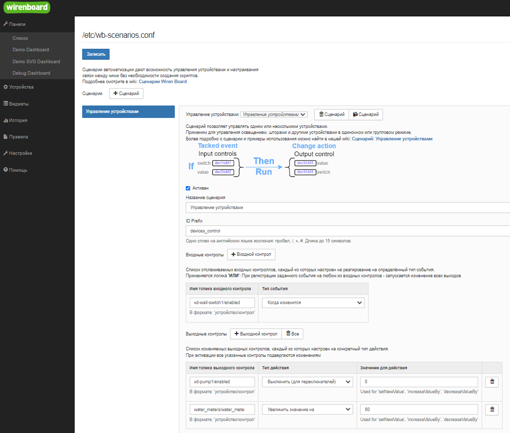

# Сценарий управления устройствами `devices-control`

Позволяет управлять светом соединив один или несколько выключателей с одним или несколькими световыми приборами
Удобен для реализации разных случаев:

- Мастер выключателя - один выключатель выключает весь свет в помешениях
- Проходной выключатель - несколько выключателей управляют одним световым прибором
- Управление шторами

Конфигурация выглядит следующим образом

Для добавления новых типов отслеживаемых событий или действий над контролом - нужно
- Добавить в схему новый тип события/действия в соответствующий выпадающий список
- Добавить в таблицу событие или действие с тем же названием enum которое выбрали в схеме
- Описать функцию хендлер которая
  - Событие - вернет тру если событие произошло
  - Действие - вернет новое значение параметра в зависимости от логики действия
