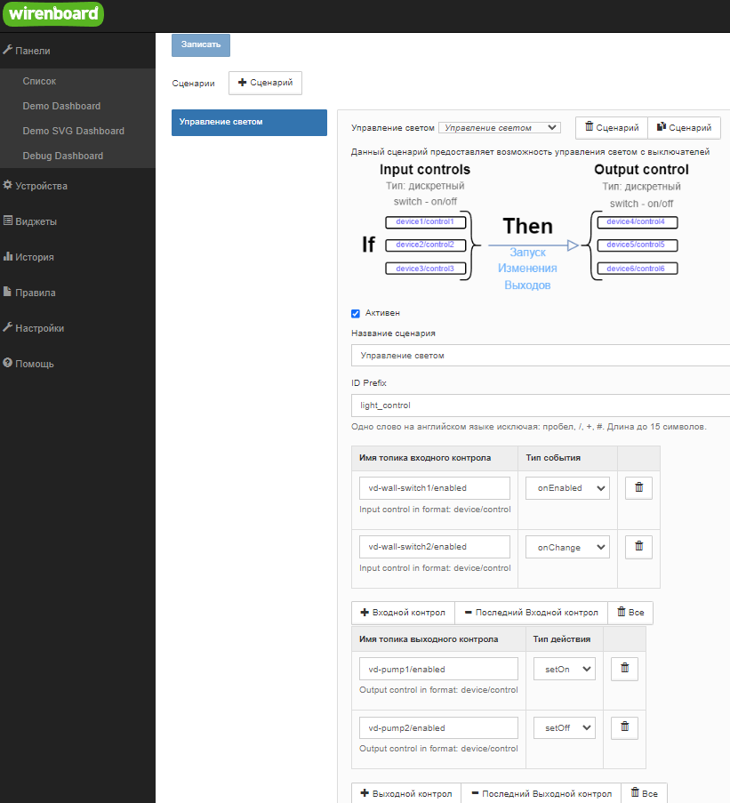

# Сценарий управления светом

Позволяет управлять светом соединив один или несколько выключателей с одним или несколькими световыми приборами
Удобен для реализации разных случаев:
- Мастер выключателя - один выключатель выключает весь свет в помешениях
- Проходной выключатель - несколько выключателей управляют одним световым прибором

Конфигурация выглядит следующим образом

