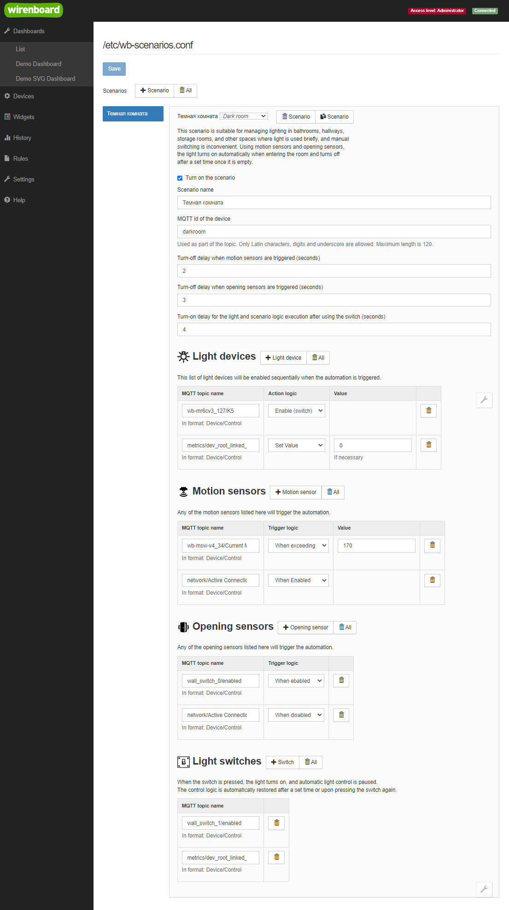

# Сценарий управления светом `light control`

Позволяет управлять светом в общем и темной комнатой в частности
Удобен для автоматического включения света в комнатах временного прибывания

- Коридор
- Туалет
- Ванная (могут быть проблеммы с определением движения за шторкой)

Конфигурация выглядит следующим образом

<p align="center">
    
</p>

## Логика работы сценария

Сценарий может работать по одному из типов датчиков, либо сразу по нескольким

- Датчик движения - включает свет при наличии движения
- Датчик открытия двери - включает свет при открытии двери
- Выключатель - дает возможность управлять светом привычным способом

Датчик открытия двери нужен для того чтобы свет включался мгновенно после того
как открылась дверь в помещение, и вы входили уже в освещенное помещение.

Есть один таймер выключения света - значение которого отображается
в виртуальном устройстве

- При срабатывании датчика открытия двери включается свет и ставится таймер
  на отключение света равный установленному в настройках
- Далее при входе в помешение срабатывает один из датчиков движения, после
  чего старый таймер удаляется и включается свет бессрочно. Сценарий
  запоминает что находится в состоянии ожидания выключения и ждет окончания
  движения.
- Далее при детектировании остановки движени - ставится новый таймер
  на отключение и система сбрасывает состояние на начальное, в котором ничего
  не ждет.

Логика установки таймера на выключение именно при окончании движения важна
для беспроводных датчиков которые передают только true и false при
изменении состояния. Это нужно по двум причинам:

1) Необходима для корректной работы датчиков zeegbe
   Они могут находиться в состоянии true долго, дольше чем вы установите таймер
   Возможности обновлять таймер кроме как по изменению состояни на выкл нет

2) Уменьшают колличество активаций таймера датчиков со значением типа value
   Мы не обновляем таймер каждый раз при получении нового значения больше трешхолда
   а устанавливаем таймер только если движение уже не видно.

## Использование модуля

Вы можете использовать функционал управления светом из своих правил wb-rules
Для этого нужно сделать 3 шага:

1) Подключить модуль
2) Создать объект настроек где прописать что вы хотите использовать
3) Инициализировать алгоритм указав
   - Имя виртуального устройства
   - Созданный объект конфигурации

```js
/**
 * @file: light_init.js
 */

// Step 1: include light module
var lightControl = require('light-control.mod');

function main() {
  log.debug('Start init logic for: Bathroom light');

  // Step 2: Configure algorithm for light
  var cfg = {
    idPrefix: 'bathroom_light',
    isDebugEnabled: false,
    delayByMotionSensors: 8,
    delayByOpeningSensors: 12,
    isDelayEnabledAfterSwitch: true,
    delayBlockAfterSwitch: 16,
    lightDevices: [
                    {
                        "behaviorType": "setEnable",
                        "mqttTopicName": "wb-mr6cv3_127/K4"
                    },
                    {
                        "behaviorType": "setEnable",
                        "mqttTopicName": "wb-mr6cv3_127/K5"
                    }
                ],
    lightSwitches: [
                    {
                        "mqttTopicName": "wall_switch_0/enabled"
                    },
                    {
                        "mqttTopicName": "wall_switch_1/enabled"
                    }
                ],
    motionSensors: [
                    {
                        "actionValue": 170,
                        "behaviorType": "whileValueHigherThanThreshold",
                        "mqttTopicName": "wb-msw-v4_34/Current Motion"
                    }
                   ],
    openingSensors: [
                    {
                        "behaviorType": "whenEnabled",
                        "mqttTopicName": "wall_switch_2/enabled"
                    },
                    {
                        "behaviorType": "whenEnabled",
                        "mqttTopicName": "wall_switch_3/enabled"
                    }
                    ],
  };

  
  // Step 3: init light algorithm
  var isInitSucess = lightControl.init('Bathroom light', cfg);
  if (!isInitSucess) {
    log.error(
      'Error: Init operation aborted for scenario with "idPrefix": ' +
        cfg.idPrefix
    );
    return;
  }

  log.debug('Initialization successful for: Bathroom light');
}

main();
```
