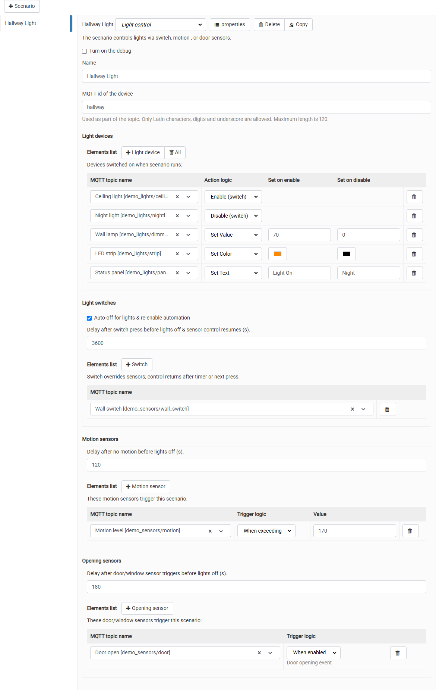
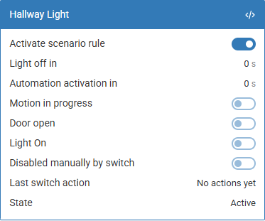

# Сценарий управления светом `lightControl`

## Общее описание

Сценарий автоматически управляет освещением по датчикам движения, датчикам
открытия двери и настенным выключателям. Удобен для помещений временного
пребывания, где свет должен включаться сам и выключаться по таймеру.

Типичные применения:

- Коридор — свет по движению с выключением через заданное время
- Санузел — свет по датчику открытия двери, чтобы входить в уже освещённое
  помещение
- Ванная — по движению (возможны сложности с определением движения за шторкой)

Конфигуратор сценария выглядит следующим образом:

<p align="center">
    
</p>

## Логика работы

Сценарий может работать по одному типу датчиков или сразу по нескольким.
Есть один общий таймер выключения света, его текущее значение отображается
в виртуальном устройстве.

### Датчик движения

- Включает свет при наличии движения
- После окончания движения запускается таймер выключения

Таймер ставится именно по окончании движения, а не по его началу. Это важно
для беспроводных датчиков, которые передают только `true`/`false` при смене
состояния:

1. Корректная работа Zigbee-датчиков. Они могут держать состояние `true`
   дольше, чем выставленный таймер, а обновить таймер иначе как по переходу
   в `false` возможности нет.
2. Меньше активаций таймера для датчиков со значением типа `value`. Таймер не
   обновляется на каждое значение выше порога, а ставится только когда движение
   уже пропало.

### Датчик открытия двери

- Включает свет при открытии двери
- Таймер выключения запускается сразу при открытии. Закрывание двери на логику
  не влияет, свет остаётся включённым

### Настенный выключатель

- Даёт управлять светом привычным способом. При включении света выключателем
  все автоматизации блокируются до момента выключения света выключателем
- Свет выключается и автоматизации снова включаются либо повторным нажатием
  выключателя, либо, если включена опция автоматического выключения, по
  истечении заданного таймаута

### Совместная работа таймеров

- При открытии двери включается свет и ставится таймер на отключение, равный
  заданной для двери задержке
- При входе срабатывает датчик движения, старый таймер снимается, свет
  включается бессрочно, сценарий переходит в ожидание окончания движения
- По окончании движения ставится новый таймер на задержку для движения,
  состояние сбрасывается в исходное

### Управляемые устройства и типы воздействия

Каждое устройство в списке управляемого света задаётся типом воздействия
`behaviorType`. От него зависит, какой контрол требуется и что сценарий пишет
в него при включении и выключении света.

| `behaviorType` | Тип контрола | Включение | Выключение |
|---|---|---|---|
| `setEnable` | `switch` | `true` | `false` |
| `setDisable` | `switch` | `false` | `true` |
| `setValueNumericInput` | `value` | значение из `actionValue` | значение из `resetValue` (по умолчанию `0`) |
| `setText` | `text` | текст из `actionValue` | текст из `resetValue` (по умолчанию пустая строка) |
| `setColor` | `rgb` | цвет из `actionValue` | цвет из `resetValue` (по умолчанию белый `#ffffff`) |

Для `setEnable` и `setDisable` значения не задаются, свет просто включается и
выключается. `setDisable` работает инверсно `setEnable` — канал гаснет, когда
сценарий включает свет, и загорается, когда выключает. Это удобно для нагрузок,
которые должны быть выключены при активном освещении (например, вытяжка или
ночной индикатор). Обычные и инверсные каналы можно смешивать в одной группе,
каждый переключается по своей логике.

Для остальных типов есть два значения:

- `actionValue` — что применить при включении света («Включить со значением»)
- `resetValue` — что применить при выключении света («Выключить со значением»)

`resetValue` необязателен. Если он не задан, подставляется значение по умолчанию
для типа (число `0`, пустой текст, белый цвет). Цвет задаётся hex-строкой
(например `#ff8040`), сценарий сам переводит его в формат WB `R;G;B` при
публикации в rgb-контрол. В смешанной группе можно совмещать устройства разных
типов, каждое переключается своим значением.

## Параметры конфигурации

### Основные настройки

| Поле | Тип | Описание |
|---|---|---|
| `name` | string | Имя сценария и виртуального устройства |
| `id_prefix` | string | Префикс имён виртуального устройства и правил |
| `isDebugEnabled` | boolean | Расширенное логирование и отладочные контролы |

### Управляемый свет (`lightDevices`)

Список выходных устройств, минимум один элемент. Каждый элемент:

| Поле | Тип | Описание |
|---|---|---|
| `mqttTopicName` | string | Имя контрола `"устройство/контрол"` |
| `behaviorType` | string | `setEnable`, `setDisable`, `setValueNumericInput`, `setText`, `setColor` |
| `actionValue` | any | Значение при включении |
| `resetValue` | any | Значение при выключении, необязательный параметр |

### Датчики движения (`motionSensors`)

| Поле | Тип | Описание |
|---|---|---|
| `delayToLightOff` | number | Секунды до выключения света после окончания движения (по умолчанию 120) |
| `sensorObjects` | array | Список датчиков |

Каждый датчик:

| Поле | Тип | Описание |
|---|---|---|
| `mqttTopicName` | string | Имя контрола |
| `behaviorType` | string | `whileValueHigherThanThreshold` или `whenEnabled` |
| `actionValue` | number | Порог для `whileValueHigherThanThreshold` (по умолчанию 170) |

### Датчики открытия двери (`openingSensors`)

| Поле | Тип | Описание |
|---|---|---|
| `delayToLightOff` | number | Секунды до выключения света после открытия двери (по умолчанию 180) |
| `sensorObjects` | array | Список датчиков |

Каждый датчик:

| Поле | Тип | Описание |
|---|---|---|
| `mqttTopicName` | string | Имя контрола |
| `behaviorType` | string | `whenEnabled` (по открытию) или `whenDisabled` (по закрытию) |

### Настенные выключатели (`lightSwitches`)

| Поле | Тип | Описание |
|---|---|---|
| `isDelayEnabled` | boolean | Автоматически выключать свет и включать автоматику по таймауту |
| `delayToLightOffAndEnable` | number | Секунды блокировки автоматики после ручного включения (по умолчанию 3600) |
| `sensorObjects` | array | Список выключателей, каждый с полем `mqttTopicName` |

## Пример конфигурации

Пример прихожей со всеми типами выходных действий сразу: потолочный свет
(реле), ночник (инверсно — горит, пока основной свет выключен), диммируемое бра,
RGB-подсветка и текстовая панель статуса. Включают свет датчик движения, датчик
двери и настенный выключатель.

Пример — один элемент массива `scenarios` в файле `/etc/wb-scenarios.conf`:

```json
{
  "componentVersion": 1,
  "scenarioType": "lightControl",
  "name": "Hallway Light",
  "id_prefix": "hallway",
  "isDebugEnabled": false,
  "lightDevices": {
    "sensorObjects": [
      {
        "mqttTopicName": "demo_lights/ceiling",
        "behaviorType": "setEnable"
      },
      {
        "mqttTopicName": "demo_lights/nightlight",
        "behaviorType": "setDisable"
      },
      {
        "mqttTopicName": "demo_lights/dimmer",
        "behaviorType": "setValueNumericInput",
        "actionValue": 70,
        "resetValue": 0
      },
      {
        "mqttTopicName": "demo_lights/strip",
        "behaviorType": "setColor",
        "actionValue": "#ff8800",
        "resetValue": "#000000"
      },
      {
        "mqttTopicName": "demo_lights/panel",
        "behaviorType": "setText",
        "actionValue": "Light On",
        "resetValue": "Night"
      }
    ]
  },
  "motionSensors": {
    "delayToLightOff": 120,
    "sensorObjects": [
      {
        "mqttTopicName": "demo_sensors/motion",
        "behaviorType": "whileValueHigherThanThreshold",
        "actionValue": 170
      }
    ]
  },
  "openingSensors": {
    "delayToLightOff": 180,
    "sensorObjects": [
      {
        "mqttTopicName": "demo_sensors/door",
        "behaviorType": "whenEnabled"
      }
    ]
  },
  "lightSwitches": {
    "isDelayEnabled": true,
    "delayToLightOffAndEnable": 3600,
    "sensorObjects": [
      {
        "mqttTopicName": "demo_sensors/wall_switch"
      }
    ]
  }
}
```

## Учёт внешних воздействий на свет

Светом, которым управляет сценарий, может управлять и что-то ещё — человек
кнопкой, другой сценарий, приложение, голосовой помощник. Сценарий отслеживает
такие изменения, сравнивая текущее значение каждого канала со значением, которое
он сам применял. Результат он публикует в контрол `lastSwitchAction`, а на полное
внешнее выключение реагирует логикой.

Механизм решает три задачи.

**Единый статус для группы из разных источников.** Группа собирается из разных
ламп, реле и диммеров, и общего «включено/выключено» на всю группу у оборудования
нет. Сценарий сводит их к одному состоянию сам. Пока часть каналов изменена
извне, а часть нет, он фиксирует частичное изменение (`Частично изменено извне`)
и намеренно не трогает общий индикатор `lightOn`. Иначе одно переключение общего
тоггла переприменило бы состояние сразу ко всем лампам и сломало бы то, что
пользователь выставил вручную.

**Мгновенный сброс блокировок и таймеров.** Настенный выключатель может на время
заблокировать автоматику (`logicDisabledByWallSwitch`), чтобы движение не
перебивало ручное управление. Например, человек зашёл в ванную и включил свет
выключателем, автоматика заблокирована. Потом он уходит и гасит весь свет извне,
скажем мастер-выключателем всей квартиры или из приложения. Сценарий видит полное
внешнее выключение (`Выключено извне`), сбрасывает блокировку выключателя, признак
движения (`motionInProgress`) и свои таймеры отсчёта. Без этого автоматика
осталась бы заблокированной в тёмной пустой комнате и не сработала бы на движение
при следующем входе.

**Синхронизация индикации.** Состояние света в виртуальном устройстве показывает
один общий тоггл `lightOn`, а не отдельный переключатель на каждую лампу. Когда
весь свет группы включают или выключают извне, сценарий подтягивает `lightOn` под
реальное состояние, чтобы в интерфейсе было видно, горит свет или нет. При
частичном изменении общий индикатор не трогается, по нему нельзя однозначно
сказать «включено» или «выключено».

Значения контрола `lastSwitchAction`

| Значение | Описание |
|---|---|
| Нет операций | Сценарий ещё ничего не переключал |
| Включено сценарием | Свет включён сценарием |
| Выключено сценарием | Свет выключен сценарием |
| Включено извне | Свет включён снаружи, не сценарием |
| Выключено извне | Свет выключен снаружи, сценарий сбросил свои таймеры и состояние |
| Частично изменено извне | Часть ламп изменена снаружи |
| Частично изменено сценарием | Часть ламп изменена сценарием |

## Виртуальное устройство

Сценарий создаёт виртуальное устройство `wbsc_<id_prefix>`. Часть контролов
появляется только при наличии соответствующих датчиков.

| Контрол | Тип | Условие | Описание |
|---|---|---|---|
| `rule_enabled` | switch | всегда | Включение/выключение сценария |
| `remainingTimeToLightOffInSec` | value (s) | всегда | Отсчёт до выключения света |
| `remainingTimeToLogicEnableInSec` | value (s) | есть выключатели | Отсчёт до включения автоматики |
| `motionInProgress` | switch | есть датчики движения | Наличие движения |
| `doorOpen` | switch | есть датчики двери | Дверь открыта |
| `lightOn` | switch | всегда | Свет включён (индикатор) |
| `logicDisabledByWallSwitch` | switch | есть выключатели | Автоматика отключена ручным выключателем |
| `lastSwitchAction` | value | всегда | Тип последнего переключения, см. раздел [«Учёт внешних воздействий на свет»](#учёт-внешних-воздействий-на-свет) |

Внешний вид виртуального устройства:

<p align="center">
    
</p>

## Ограничения

1. **Перезапуск wb-rules не переживают таймеры.** Отсчёт выключения хранится
   в памяти. При перезапуске сервиса внутри активного отсчёта свет останется
   включённым, автоматический таймер не восстанавливается.

2. **Пустой текст стирает retained-значение.** Для `setText` без `resetValue`
   при выключении публикуется пустая строка, и контрол читается как `null` до
   следующей записи. На реальных устройствах, которые сами публикуют своё
   состояние, это не влияет.

## Использование модуля

Модуль управления светом можно использовать напрямую из своих правил
`wb-rules`. Для этого нужно сделать 4 шага:

1. Импортировать класс сценария
2. Создать новый экземпляр класса
3. Создать объект настроек
4. Инициализировать сценарий, передав имя виртуального устройства и конфигурацию

### Параметры конфигурации

При программном использовании структура плоская — списки датчиков передаются
массивами напрямую, а задержки отдельными полями верхнего уровня. В конфиг-файле
те же данные вложены в объекты. Маппинг выполняет модуль инициализации
`scenario-init-light-control.mod.js`. Поля датчиков и управляемых устройств
совпадают с разделом «Параметры конфигурации» выше, отличаются только имена
полей задержек и префикса:

| Поле в коде | Поле в конфиг-файле |
|---|---|
| `idPrefix` | `id_prefix` |
| `delayByMotionSensors` | `motionSensors.delayToLightOff` |
| `delayByOpeningSensors` | `openingSensors.delayToLightOff` |
| `isDelayEnabledAfterSwitch` | `lightSwitches.isDelayEnabled` |
| `delayBlockAfterSwitch` | `lightSwitches.delayToLightOffAndEnable` |
| `lightDevices` | `lightDevices.sensorObjects` |
| `motionSensors` | `motionSensors.sensorObjects` |
| `openingSensors` | `openingSensors.sensorObjects` |
| `lightSwitches` | `lightSwitches.sensorObjects` |

### Пример кода

```js
/**
 * @file: light-init.js
 */

// Step 1: import module
var CustomTypeSc = require('light-control.mod').LightControlScenario;

function main() {
  scenarioName = 'Light control';
  log.debug('Start init logic for: "{}"', scenarioName);

  // Step 2: Create new instance with scenario class
  var scenario = new CustomTypeSc();

  // Step 3: Configure algorithm
  var cfg = {
    idPrefix: 'bathroom_light',
    isDebugEnabled: false,
    delayByMotionSensors: 8,
    delayByOpeningSensors: 12,
    isDelayEnabledAfterSwitch: true,
    delayBlockAfterSwitch: 16,
    lightDevices: [
      {
        'behaviorType': 'setEnable',
        'mqttTopicName': 'wb-mr6cv3_127/K4',
      },
      {
        'behaviorType': 'setDisable',
        'mqttTopicName': 'wb-mr6cv3_127/K5',
      },
      {
        'behaviorType': 'setValueNumericInput',
        'mqttTopicName': 'wb-mdm3_50/Channel 1',
        'actionValue': 100,
        'resetValue': 0,
      },
      {
        'behaviorType': 'setColor',
        'mqttTopicName': 'wb-led_21/RGB Strip',
        'actionValue': '#ff8040',
        'resetValue': '#ffffff',
      },
      {
        'behaviorType': 'setText',
        'mqttTopicName': 'hd44780_1/Line 1',
        'actionValue': 'Light on',
      },
    ],
    lightSwitches: [
      {
        'mqttTopicName': 'wall_switch_0/enabled',
      },
      {
        'mqttTopicName': 'wall_switch_1/enabled',
      },
    ],
    motionSensors: [
      {
        'actionValue': 170,
        'behaviorType': 'whileValueHigherThanThreshold',
        'mqttTopicName': 'wb-msw-v4_34/Current Motion',
      },
    ],
    openingSensors: [
      {
        'behaviorType': 'whenEnabled',
        'mqttTopicName': 'wall_switch_2/enabled',
      },
      {
        'behaviorType': 'whenEnabled',
        'mqttTopicName': 'wall_switch_3/enabled',
      },
    ],
  };

  // Step 4: init algorithm
  try {
    var isInitSuccess = scenario.init(scenarioName, cfg);

    if (!isInitSuccess) {
      log.error('Init operation aborted for scenario: "{}"', scenarioName);
      return;
    }

    log.debug('Initialization successful for: "{}"', scenarioName);
  } catch (error) {
    log.error(
      'Exception during scenario initialization: "{}" for scenario: "{}"',
      error.message || error,
      scenarioName
    );
  }
}

main();
```

После запуска скрипта в устройствах появится новое виртуальное устройство
управления, аналогичное создаваемому через визуальный конфигуратор в веб-интерфейсе
контроллера.

<p align="center">
    
</p>
