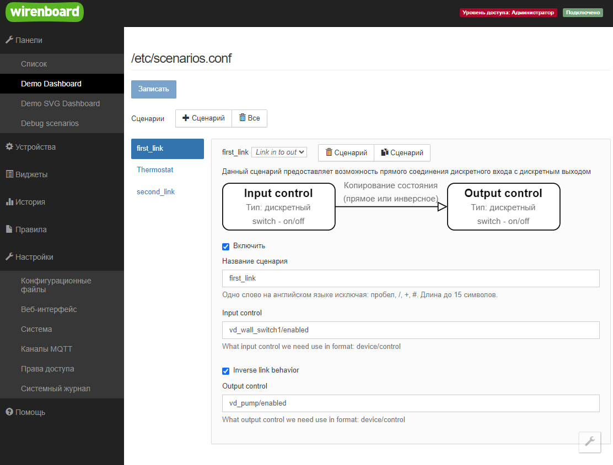

# Сценарий соединения входа и выхода `link-in-to-out`

Позволяет соединить вход с выходом

Это самый простой сценарий - удобен для примера когда создаешь свой сценарий.

Конфигурация выглядит следующим образом

