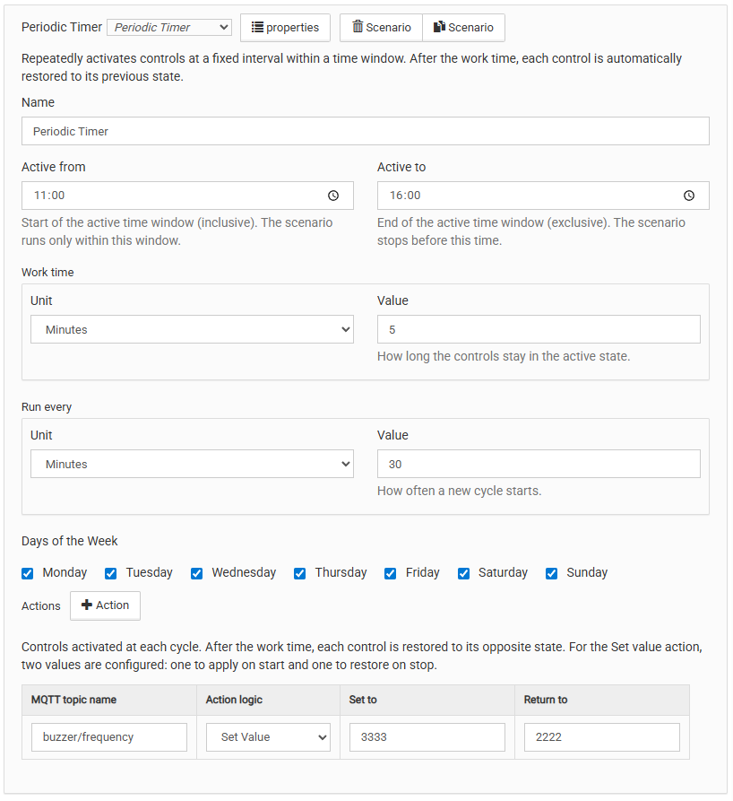
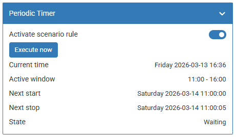

# Сценарий периодического таймера `periodicTimer`

## Общее описание

Сценарий активирует набор контролов с заданным интервалом внутри
настраиваемого временного окна. По истечении времени работы каждый
контрол автоматически возвращается в обратное состояние.

Типичные применения:

- Периодический полив или орошение (включить насос → подождать → выключить)
- Цикличная вентиляция помещений
- Импульсное управление нагрузкой (включить на 5 минут каждый час)

Конфигуратор сценария выглядит следующим образом:

<p align="center">
    
</p>

## Логика работы

### Автоматический цикл

При входе в активное окно сценарий немедленно запускает первый цикл.
Каждый цикл состоит из двух фаз:

```
Старт цикла:
  → выполнить outControls (включить контролы)
  → ждать workTime

Конец workTime:
  → выполнить reverse (выключить контролы)
  → ждать (interval − workTime)
  → если следующий цикл ещё в окне → новый цикл
  → иначе → ждать следующего открытия окна
```

Интервал и время работы задаются в секундах, минутах или часах.

### Reverse-логика

Каждое действие автоматически отменяется по окончании работы:

| Действие при старте                           | Действие при стопе                               |
| --------------------------------------------- | ------------------------------------------------ |
| Включить (`setEnable`)                        | Выключить (`setDisable`)                         |
| Выключить (`setDisable`)                      | Включить (`setEnable`)                           |
| Установить значение (`setValue`, `initValue`) | Установить значение (`setValue`, `reverseValue`) |

### Ручной запуск

Кнопка «Выполнить сейчас» немедленно запускает один цикл вне зависимости
от текущего времени и окна (сценарий должен быть включён). После окончания рабочей фазы контролы
возвращаются в исходное состояние. Если в момент завершения сценарий
находится внутри активного окна, автоматический цикл возобновляется
немедленно. Автоматическое расписание не сдвигается.

### Состояние (`state`)

| Значение     | Описание                                            |
| ------------ | --------------------------------------------------- |
| **Активен**  | Включён, сегодня рабочий день, текущее время в окне |
| **Ожидает**  | Включён, но вне окна или не рабочий день            |
| **Отключен** | Сценарий выключен (`rule_enabled = false`)          |

---

## Параметры конфигурации

### Активен с / Активен до (`activeFrom` / `activeTo`)

Временное окно активности в формате `ЧЧ:ММ`. Граница `activeTo` эксклюзивна —
в этот момент сценарий уже останавливается.

Поддерживается перенос через полночь: например `22:00`–`06:00`.

### Запускать каждые (`interval`)

Как часто начинается новый цикл. Задаётся как значение + единица:

- **Единица** (`intervalUnit`): `hours`, `minutes`, `seconds`
- **Значение** (`intervalValue`): положительное целое число

### Время работы (`workTime`)

Как долго контролы остаются в активном состоянии. Задаётся аналогично:

- **Единица** (`workTimeUnit`): `hours`, `minutes`, `seconds`
- **Значение** (`workTimeValue`): положительное целое число

### Дни недели (`scheduleDaysOfWeek`)

Дни, когда сценарий активен. Минимум один день.

### Действия (`outControls`)

Массив действий, выполняемых при старте каждого цикла. Минимум 1 элемент.

| Поле            | Тип    | Описание                              |
| --------------- | ------ | ------------------------------------- |
| `mqttTopicName` | string | Имя контрола: `"device/control"`      |
| `behaviorType`  | string | `setEnable`, `setDisable`, `setValue` |
| `initValue`     | number | Для `setValue`: значение при старте   |
| `reverseValue`  | number | Для `setValue`: значение при стопе    |

---

## Пример конфигурации

### Полив газона: насос на 10 минут каждые 2 часа, по будням с 06:00 до 22:00

```json
{
  "scenarioType": "periodicTimer",
  "componentVersion": 1,
  "name": "Полив газона",
  "activeFrom": "06:00",
  "activeTo": "22:00",
  "interval": { "intervalUnit": "hours", "intervalValue": 2 },
  "workTime": { "workTimeUnit": "minutes", "workTimeValue": 10 },
  "scheduleDaysOfWeek": [
    "monday",
    "tuesday",
    "wednesday",
    "thursday",
    "friday"
  ],
  "outControls": [
    {
      "mqttTopicName": "irrigation/pump",
      "behaviorType": "setEnable"
    }
  ]
}
```

### Вентиляция: включать на 5 минут каждые 30 минут круглосуточно

```json
{
  "scenarioType": "periodicTimer",
  "componentVersion": 1,
  "name": "Вентиляция",
  "activeFrom": "00:00",
  "activeTo": "23:59",
  "interval": { "intervalUnit": "minutes", "intervalValue": 30 },
  "workTime": { "workTimeUnit": "minutes", "workTimeValue": 5 },
  "scheduleDaysOfWeek": [
    "monday",
    "tuesday",
    "wednesday",
    "thursday",
    "friday",
    "saturday",
    "sunday"
  ],
  "outControls": [
    {
      "mqttTopicName": "ventilation/fan",
      "behaviorType": "setEnable"
    }
  ]
}
```

---

## Виртуальное устройство

Сценарий создаёт виртуальное устройство `wbsc_<idPrefix>` с контролами:

| Контрол         | Тип        | Описание                                                          |
| --------------- | ---------- | ----------------------------------------------------------------- |
| `rule_enabled`  | switch     | Включение/выключение сценария                                     |
| `execute_now`   | pushbutton | Ручной немедленный запуск                                         |
| `current_time`  | text       | Текущее системное время                                           |
| `active_window` | text       | Временное окно: «18:00 - 19:00»                                   |
| `next_start`    | text       | Следующий старт цикла (или открытие окна); `--:--` при отключении |
| `next_stop`     | text       | Конец текущей или следующей рабочей фазы; `--:--` при отключении  |
| `state`         | value      | Состояние: «Активен» / «Ожидает» / «Отключен»                     |

### Внешний вид

Создаваемое сценарием виртуальное устройство выглядит следующим образом:

<p align="center">
    
</p>

---

## Особенности использования

1. **Первый цикл стартует немедленно** при входе в окно — без ожидания
   следующей минуты.

2. **Перезапуск wb-rules:** если сценарий включён и перезапуск произошёл
   внутри окна — первый цикл запускается сразу. Если снаружи — ждём
   входа в окно. Если сценарий был выключен — цикл не запускается, даже
   находясь внутри окна.

3. **workTime и interval** могут быть в разных единицах. Например,
   interval=1 час, workTime=30 секунд — допустимо.

4. **Ручной запуск** сбрасывает текущий цикл и немедленно запускает новый.
   Если после его окончания сценарий находится внутри активного окна,
   следующий цикл стартует автоматически без ожидания cron-тика.

---

## Ограничения

1. **Точность выполнения:** интервал и время работы выдерживаются через
   `setTimeout` — точность до секунды. Однако вход в окно и выход из него
   определяются cron-правилом (раз в минуту), поэтому фактический старт
   первого цикла может опаздывать до 60 секунд.

2. **Перезапуск wb-rules:** таймеры не переживают рестарт сервиса.
   При перезапуске внутри окна первый цикл запускается сразу; работа
   прерванного цикла не восстанавливается.

3. **Wrap-around окно и дни недели:** для окна типа `22:00`–`06:00`
   проверка дня недели выполняется по текущему календарному дню.
   При смене суток (00:00) в ночном окне сценарий проверит новый день
   и остановится, если он не входит в расписание. Например, окно
   `22:00`–`06:00` с расписанием «только понедельник» будет активно
   с 22:00 пн до 00:00 вт — но не до 06:00.

---

## Использование модуля

Вы можете использовать модуль периодического таймера напрямую из своих
правил `wb-rules`. Для этого нужно сделать 4 шага:

1. Импортировать класс `PeriodicTimerScenario`
2. Создать новый экземпляр класса
3. Создать объект настроек
4. Инициализировать сценарий, передав имя и конфигурацию

### Параметры конфигурации

`PeriodicTimerConfig`:

> **Примечание:** формат полей `interval` и `workTime` при программном
> использовании (`unit`/`value`) отличается от формата в конфиг-файле
> (`intervalUnit`/`intervalValue`, `workTimeUnit`/`workTimeValue`).
> Маппинг выполняет модуль инициализации `scenario-init-periodic-timer.mod.js`.

1. `idPrefix` {string} — необязательный. Префикс MQTT-имён виртуального
   устройства и правил. Если не указан, генерируется транслитерацией из имени.
2. `activeFrom` {string} — начало окна активности в формате `HH:MM` (включительно).
3. `activeTo` {string} — конец окна активности в формате `HH:MM` (исключительно).
4. `interval` {object} — период повторения цикла:
   - `unit` {string}: `'hours'`, `'minutes'` или `'seconds'`
   - `value` {number}: положительное целое число
5. `workTime` {object} — время работы контролов (тот же формат что `interval`).
6. `scheduleDaysOfWeek` {array} — дни недели активности:
   `'monday'`, `'tuesday'`, `'wednesday'`, `'thursday'`,
   `'friday'`, `'saturday'`, `'sunday'`. Минимум один день.
7. `outControls` {array} — действия с reverse-логикой. Каждый элемент:
   - `mqttTopicName` {string}: имя контрола `'device/control'`
   - `behaviorType` {string}: `'setEnable'`, `'setDisable'` или `'setValue'`
   - `initValue` {number}: для `setValue` — значение при старте
   - `reverseValue` {number}: для `setValue` — значение при стопе

### Пример кода

```js
/**
 * @file: init-irrigation.js
 */

// Step 1: import module
var CustomTypeSc = require('periodic-timer.mod').PeriodicTimerScenario;

function main() {
  var scenarioName = 'Lawn irrigation';

  // Step 2: create instance
  var scenario = new CustomTypeSc();

  // Step 3: configuration
  var cfg = {
    idPrefix: 'lawn_irrigation',
    activeFrom: '06:00',
    activeTo: '22:00',
    interval: { unit: 'hours', value: 2 },
    workTime: { unit: 'minutes', value: 10 },
    scheduleDaysOfWeek: [
      'monday',
      'tuesday',
      'wednesday',
      'thursday',
      'friday',
    ],
    outControls: [
      {
        mqttTopicName: 'irrigation/pump',
        behaviorType: 'setEnable',
      },
    ],
  };

  // Step 4: init algorithm
  try {
    var isInitSuccess = scenario.init(scenarioName, cfg);

    if (!isInitSuccess) {
      log.error('Init failed for: "{}"', scenarioName);
      return;
    }

    log.debug('Init successful for: "{}"', scenarioName);
  } catch (error) {
    log.error(
      'Exception during init: "{}" for: "{}"',
      error.message || error,
      scenarioName
    );
  }
}

main();
```
