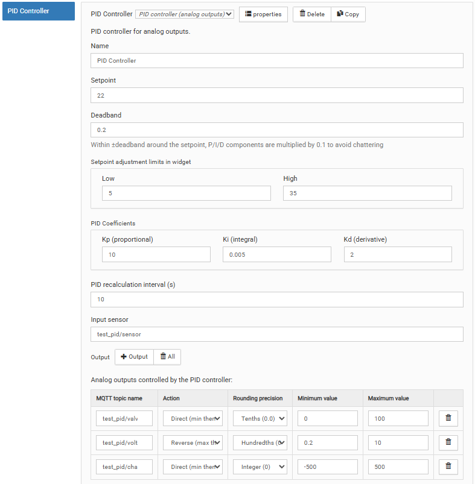
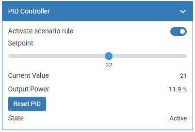

# Сценарий ПИД-регулятора `pidController`

## Общее описание

Данный сценарий реализует ПИД-регулятор для управления аналоговыми выходами.
Сценарий записывает вычисленные значения напрямую в аналоговые выходы.

Конфигуратор сценария:

<p align="center">
    
</p>

## Логика работы

### Цикл расчёта

Каждые `calculationPeriodSec` секунд сценарий:

1. Считывает текущее значение датчика
2. Считывает уставку из виртуального устройства
3. Вычисляет выход ПИД (0-100%)
4. Для каждого актуатора пересчитывает выход в единицы актуатора:
   - **direct**: `value = outputMin + (pidOutput / 100) * (outputMax - outputMin)`
   - **inverted**: `value = outputMax - (pidOutput / 100) * (outputMax - outputMin)`
5. Округляет полученное значение согласно настройке `precision`:
   - `0` — до целого
   - `1` — до десятых
   - `2` — до сотых
6. Записывает значение в MQTT-топик актуатора (только при изменении)

### Мёртвая зона (deadBand)

Когда ошибка (разница между уставкой и текущим значением) попадает в зону
±deadBand, коэффициент усиления П-, И- и Д-составляющих уменьшается до 10%
от нормального. Это предотвращает микроколебания актуатора вблизи уставки,
сохраняя при этом медленную компенсацию дрейфа.

### Anti-windup

Интегральная составляющая ограничена диапазоном [0, 100] (clamping).
Это предотвращает накопление интеграла при длительном насыщении выхода.

### Выключение сценария

При отключении сценария (rule_enabled = false):

- Все актуаторы сбрасываются в минимальное значение (direct) или максимальное (inverted)
- ПИД сбрасывается (интеграл обнуляется)
- Цикл расчёта останавливается

---

## Параметры конфигурации

### Основные параметры

| Параметр        | Тип    | По умолч. | Описание                                        |
| --------------- | ------ | --------- | ----------------------------------------------- |
| Имя сценария    | string | —         | Название (1-30 символов)                        |
| Префикс MQTT ID | string | —         | Опциональный, задаёт ID виртуального устройства |
| Датчик          | string | —         | MQTT-топик входного датчика                     |
| Уставка         | number | 22        | Начальное целевое значение                      |
| Мёртвая зона    | number | 0.2       | Зона нечувствительности вокруг уставки          |

### Пределы уставки

| Параметр | По умолч. | Описание                        |
| -------- | --------- | ------------------------------- |
| Минимум  | 5         | Нижний предел слайдера уставки  |
| Максимум | 35        | Верхний предел слайдера уставки |

### Коэффициенты ПИД

| Параметр | По умолч. | Описание                     |
| -------- | --------- | ---------------------------- |
| Kp       | 10        | Пропорциональный коэффициент |
| Ki       | 0.005     | Интегральный коэффициент     |
| Kd       | 2         | Дифференциальный коэффициент |

### Интервал пересчёта ПИД

| Параметр               | По умолч. | Описание         |
| ---------------------- | --------- | ---------------- |
| Интервал пересчёта ПИД | 30 сек    | Целое число >= 1 |

### Актуаторы

Массив управляемых аналоговых выходов (минимум 1).

| Поле                | Описание                                                                            |
| ------------------- | ----------------------------------------------------------------------------------- |
| MQTT-топик          | Топик аналогового выхода                                                            |
| Тип поведения       | `direct` — прямой (мин, затем макс); `inverted` — инвертированный (макс, затем мин) |
| Точность округления | `0` — до целого, `1` — до десятых, `2` — до сотых. По умолчанию `2`                 |
| Минимум выхода      | Минимальное значение в единицах актуатора                                           |
| Максимум выхода     | Максимальное значение в единицах актуатора                                          |

---

## Виртуальное устройство

Сценарий создаёт виртуальное устройство `wbsc_<idPrefix>` с контролами:

| Контрол         | Тип        | Доступ | Описание                       |
| --------------- | ---------- | ------ | ------------------------------ |
| `rule_enabled`  | switch     | RW     | Включить/выключить сценарий    |
| `state`         | enum       | RO     | Текущее состояние сценария     |
| `setpoint`      | range      | RW     | Уставка (целевое значение)     |
| `current_value` | value      | RO     | Текущее значение датчика       |
| `output_power`  | value (%)  | RO     | Выход ПИД 0-100%               |
| `pid_reset`     | pushbutton | —      | Сброс интегратора и перезапуск |

### Внешний вид

<p align="center">
    
</p>

### Заголовок (Title)

Название виртуального устройства совпадает с именем сценария.

### Имя (Name) устройства

Формируется из двух частей:

1. `wbsc_` — статичный префикс виртуальных устройств сценариев
2. Вторая часть задаётся одним из двух способов:
   - Транслитерация имени сценария (по умолчанию)
   - Явно через параметр `idPrefix`

---

## Использование модуля

Модуль ПИД-регулятора можно использовать из скриптов `wb-rules`.

### Пример кода

```js
var CustomTypeSc = require('pid-controller.mod').PidControllerScenario;

function main() {
  var scenarioName = 'Valve control';
  var scenario = new CustomTypeSc();

  var cfg = {
    idPrefix: 'valve_ctrl',
    sensor: 'wb-msw-v4_34/Temperature',
    setpoint: 22,
    setpointLimits: { min: 5, max: 35 },
    pid: { kp: 10, ki: 0.005, kd: 2 },
    calculationPeriodSec: 30,
    deadBand: 0.2,
    actuators: [
      {
        mqttTopicName: 'wb-mao4_11/Channel 1',
        behaviorType: 'direct',
        precision: 1,
        outputMin: 0,
        outputMax: 10,
      },
    ],
  };

  try {
    var isInitSuccess = scenario.init(scenarioName, cfg);
    if (!isInitSuccess) {
      log.error('Init failed for "{}"', scenarioName);
    }
  } catch (error) {
    log.error('Exception: "{}" for "{}"', error.message, scenarioName);
  }
}

main();
```

### Пример с несколькими актуаторами

```js
var cfg = {
  sensor: 'wb-msw-v4_34/Temperature',
  setpoint: 22,
  setpointLimits: { min: 10, max: 30 },
  pid: { kp: 10, ki: 0.005, kd: 2 },
  calculationPeriodSec: 30,
  deadBand: 0.3,
  actuators: [
    {
      mqttTopicName: 'wb-mao4_11/Channel 1',
      behaviorType: 'direct',
      precision: 1,
      outputMin: 0,
      outputMax: 10, // 0-10V выход
    },
    {
      mqttTopicName: 'wb-mao4_11/Channel 2',
      behaviorType: 'inverted',
      precision: 0,
      outputMin: 0,
      outputMax: 100, // Инвертированный клапан 0-100%
    },
  ],
};
```
