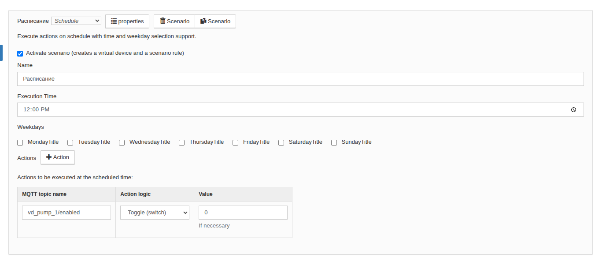
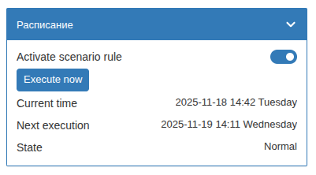

# Сценарий расписания `schedule`

Позволяет автоматически выполнять набор действий по заданному расписанию на определенное время.
Удобен для автоматизации повторяющихся задач:

- Включение/выключение устройств в определенное время
- Управление освещением по распорядку дня
- Запуск других сценариев по расписанию через управляющий контрол

Конфигурация выглядит следующим образом:



## Логика работы сценария

Сценарий работает на основе cron-расписания (не системного, используется внутренний для wb-rules модуль на Golang!) и позволяет:

1) Автоматическое выполнение по расписанию:
   - Настройка времени срабатывания (ЧЧ:ММ)
   - Выбор дней недели для выполнения
   - Автоматический запуск действий в указанное время

2) Ручное выполнение:
   - Кнопка "Execute now" в виртуальном устройстве
   - Немедленное выполнение всех настроенных действий
   - Не влияет на автоматическое расписание

3) Отображение информации:
   - Текущее время системы
   - Время следующего выполнения по расписанию

## Параметры конфигурации

### Основные настройки

- **scheduleTime** (string): Время выполнения в формате "ЧЧ:ММ"

- **scheduleDaysOfWeek** (array): Массив дней недели для выполнения
  - Формат: ["monday", "tuesday", "wednesday", "thursday", "friday", "saturday", "sunday"]

### Действия (outControls)

Действия полностью соответствуют структуре сценария `devices-control`:

- **behaviorType** (string): Тип поведения из `table-handling-actions.mod.js`
- **control** (string): Имя контрола
- **actionValue** (mixed): Значение для типа поведения setValue, increaseValueBy, decreaseValueBy

## Пример конфигурации

Объект json используемый в коде

```json
{
    "enable": true,
    "name": "Расписание",
    "outControls": [
        {
            "actionValue": 1,
            "behaviorType": "toggle",
            "control": "vd_wall_switch_1/enabled"
        },
        {
            "actionValue": 1,
            "behaviorType": "toggle",
            "control": "vd_pump_1/enabled"
        }
    ],
    "scenarioType": "schedule",
    "scheduleTime": "08:56",
    "scheduleDaysOfWeek": [
        "monday",
        "tuesday",
        "wednesday",
        "thursday",
        "friday",
        "saturday",
        "sunday"
    ]
}
```

Конфигурация записанная в файле *.conf

```json
{
    "configVersion": 1,
    "scenarios": [
        {
            "componentVersion": 1,
            "enable": true,
            "name": "Расписание",
            "outControls": [
                {
                    "actionValue": 0,
                    "behaviorType": "setEnable",
                    "control": "buzzer/enabled"
                }
            ],
            "scenarioType": "schedule",
            "scheduleDaysOfWeek": [
                "tuesday"
            ],
            "scheduleTime": "14:02"
        }
    ]
}
```

## Виртуальное устройство

Сценарий создает виртуальное устройство с контролами:

- **Execute now** (pushbutton): Кнопка для немедленного выполнения действий
- **Current time** (text): Отображение текущего времени системы, подтягивается из wb-rules-system
- **Next execution** (text): Время следующего выполнения по расписанию

Внешний вид виртуального устройства:



## Особенности использования

1. **Формат времени**: Используйте 24-часовой формат без секунд (ЧЧ:ММ)

2. **Действия**: Структура действий полностью совместима с сценарием `devices-control`, что позволяет легко переносить конфигурации между сценариями: просто скопируйте массив outControls из вашего сценария типа devices-control в нужный вам сценарий расписания

3. **Системное время**: Сценарий использует системное время контроллера, убедитесь в правильной настройке часового пояса

4. **Выполнение**: При ручном запуске выполняются все настроенные действия независимо от времени и дня недели