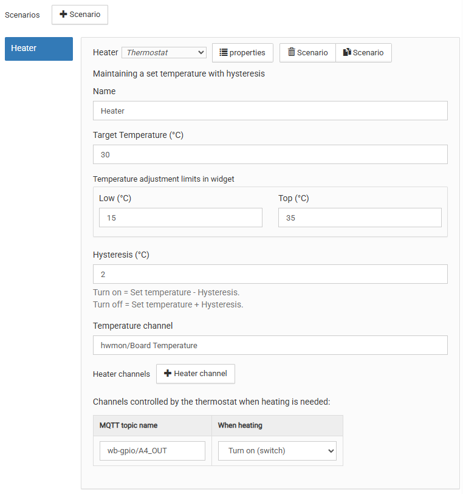
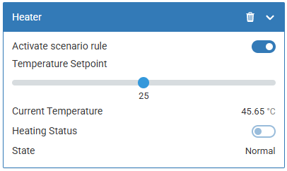
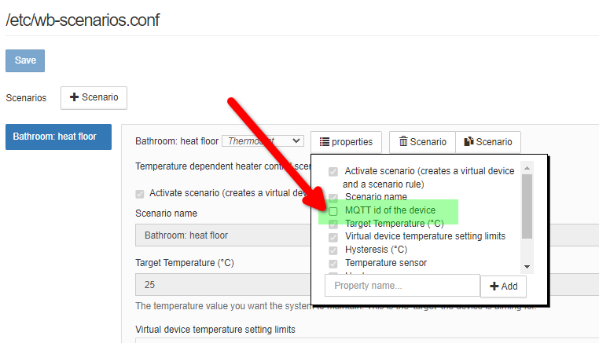

# Сценарий термостата `thermostat`

## Общее описание

Данный сценарий позволяет управлять нагревателями, например можно создать
сценарий управления теплым полом в ванной с названием: `Bathroom: heat floor`

Конфигуратор сценария выглядит следующим образом:

<p align="center">
    
</p>

## Логика работы

После сохранения сценария создается виртуальное устройство - подробнее в
отдельной секции ниже.

Сразу после инициализации:

- Целевая температура берется из конфигуратора, но ее можно изменить с
  помощью ползунка в виртуальном устройстве.
- Обогреватель включается или выключается в зависимости от конфигурации

Далее обогреватель работает по гистерезису.
Например, при целевой температуре 22 °C, и гистерезисе 2 °C, обогреватель:

- Включится при достижении 20 °C = (22 целевая - 2 гистерезис)
- Выключится при достижении 24 °C = (22 целевая + 2 гистерезис)

Виртуальное устройство позволяет управлять сценарием:

- При деактивации правила - нагреватель так же будет выключен
- При активации правила - будет обновлено актуальное показание температуры,
  и далее нагреватель будет включен только если температура датчика
  ниже выставленной

При изменении целевой температуры с помощью ползунка виртуального устройства,
актуатор будет сразу выключаться и включаться в зависимости от температуры
на датчике.

## Виртуальное устройство

С помошью виртуального устройства можно управлять созданным сценарием,
например изменять установленную температуру или отключать работу правила.
При отключении правила - нагреватель будет так же отключен.

### Внешний вид

Создаваемое сценарием виртуальное устройство выглядит следующим образом:

<p align="center">
    
</p>

### Заголовок (Title)

Название виртуального устройства будет такой же как имя
созданного вами сценария

### Имя (Name) устройства

Задается из двух частей:

1) `wbsc_ ` - статичный префикс виртуальных устройств созданных для сценариев
2) Вторая часть может быть задана двумя вариантами:
   - Транслитерированнием имени сценария указанного при его создании.
     В имени все буквы приводятся в нижний регистр, а все символы кроме
     подчеркивания `_` заменены на знак подчеркивания `_`
   - Заданное напрямую, с помошью не обязательного параметра `idPrefix`.

     Если вы хотите задать в WEBUI префикс виртуального устройства
     отличающийся от имени вашего сценария - вы можете активировать
     такую возможность в свойствах сценария как показано ниже:

     <p align="center">
         
     </p>

     Если это поле отсутствует в конфигурации или пустое, то префикс
     создается с помошью транслитерации.

     При использовании модуля термостата в скриптах - данный параметр
     указывается дополнительно в объекте конфигурации.

Пример сформированного имени виртуального устройства:

При создании сценария с именем `Bathroom: heat floor` - создается
виртуальное устройство с именем `wbsc_bathroom__heat_floor`.
Двойное подчеркивание обусловленно наличием двоеточия, которое заменено на
нижнее подчеркивание при транслитерации.

### Список контролов

У виртуального устройства есть следующие контролы:

- Переключатель статуса работы правила сценария
  Пример имени топика: `wbsc_bathroom__heat_floor/rule_enabled`
- Заданная темпрература (в градусах Цельсия):
  Этот параметр задает пользователь через WEBUI в целых градусах
  Пример имени топика: `wbsc_bathroom__heat_floor/target_temperature`
- Текущая температура (в градусах Цельсия):
  Отражает текущие показания датчика, который был указан в настройках
  Пример имени топика: `wbsc_bathroom__heat_floor/current_temperature`
- Статус нагрева (исполнительного устройства)
  Пример имени топика: `wbsc_bathroom__heat_floor/actuator_status`

## Использование модуля

Вы можете использовать модуль термостата прямо из своих
правил `wb-rules`. Для этого нужно сделать 4 шага:

1) Импортировать класс кастомного сценария
2) Создать новый инстанс класса "термостат"
3) Создать объект настроек где прописать что вы хотите использовать:
   - общие настройки целевой температуры и тд
   - топики которые вы хотите использовать для датчика и нагревателя
4) Инициализировать алгоритм указав:
   - Имя виртуального устройства
   - Созданный объект конфигурации

### Описание параметров конфигурации

Конфигурация имеет 7 параметров, из которых 1 необязательный.

ThermostatConfig:

1. `idPrefix` {string} Не обязательный параметр
   Задает строку префикса добавляемого к идентификаторам
   виртуального устройства и правила:
   - Если параметр указан, то вирт. устройство и правило будут иметь
     одинаковые имена вида `wbsc_<!idPrefix!>`
   - Если не указан (`undefined`), то правая часть создается методом
     транслитерации из имени переданного в `init()`
2. `targetTemp` {number} Целевая температура, заданная пользователем
3. `hysteresis` {number} Значение гистерезиса (диапазон переключения)
4. `tempLimitsMin` {number} Ограничение установки температуры снизу
5. `tempLimitsMax` {number} Ограничение установки температуры сверху
6. `tempSensor` {string} Имя топика отслеживаемого датчика
   Пример: датчик температуры значение которого следует слушать
   - 'wb-msw-v4_34/Temperature'
7. `actuator` {string} Имя топика управляемого нагревателя
   Пример: выход реле которым следует управлять
   - 'relay_module/K2'

### Пример кода

```js
/**
 * @file: init-heating.js
 */

// Step 1: import module
var CustomTypeSc = require('thermostat.mod').ThermostatScenario;

function main() {
  var scenarioName = 'Bathroom: heat floor';
  log.debug('Start init logic for: "{}"', scenarioName);

  // Step 2: Create new instance with scenario class
  var scenario = new CustomTypeSc();

  // Step 3: Configure algorithm
  var cfg = {
    idPrefix: 'bathroom_floor',// Не обязательный параметр, можно не указывать
    targetTemp: 22,
    tempLimitsMin: 16,
    tempLimitsMax: 29,
    hysteresis: 2,
    tempSensor: 'wb-msw-v4_34/Temperature',
    actuator: 'wb-mr6cv3_127/K6',
  };

  // Step 4: init algorithm
  try {
    var isInitSuccess = scenario.init(scenarioName, cfg);

    if (!isInitSuccess) {
      log.error('Init operation aborted for scenario: "{}"', scenarioName);
      return;
    }

    log.debug('Initialization successful for: "{}"', scenarioName);
  } catch (error) {
    log.error(
      'Exception during scenario initialization: "{}" for scenario: "{}"', 
      error.message || error, 
      scenarioName
    );
  }
}

main();
```

После запуска скрипта у вас с устройствах появится новое устройство
для управления - которое будет аналогично тому, что вы можете создать через
визульный конфигуратор в WEBUI контроллера:

<p align="center">
    
</p>
