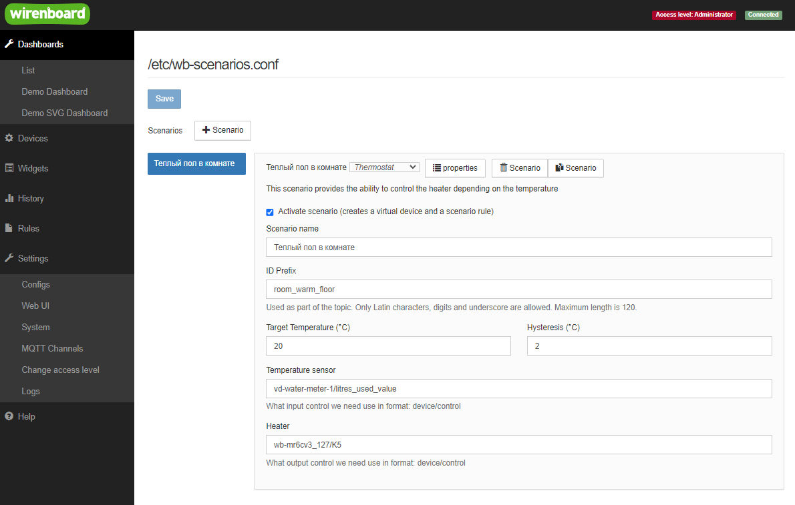
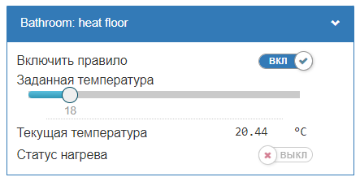

# Сценарий термостата `thermostat`

Позволяет управлять нагревателями, например теплым полом

Конфигурация выглядит следующим образом

<p align="center">
    
</p>

## Использование модуля

### Описание параметров конфигурации

Конфигурация имеет 7 параметров, из которых 1 необязательный.

ThermostatConfig:

1. `idPrefix` {string} Не обязательный префикс к имени для
   идентификации виртуального устройства и правила:
   - Если параметр указан, то ВУ и правило будут иметь имя вида
     `wbsc_<!idPrefix!>` и `wbru_<!idPrefix!>`
   - Если не указан (undefined), то правая часть создается методом
     транслитерации из имени переданного в `init()`
2. `targetTemp` {number} Целевая температура, заданная пользователем
3. `hysteresis` {number} Значение гистерезиса (диапазон переключения)
4. `tempLimitsMin` {number} Ограничение установки температуры снизу
5. `tempLimitsMax` {number} Ограничение установки температуры сверху
6. `tempSensor` {string} Имя топика входного контрола - отслеживаемый
   Пример: датчик температуры значение которого следует слушать
   'temp_sensor/temp_value'
7. `actuator` {string} Имя топика выходного контрола - управляемый
   Пример: выход реле которым следует управлять - 'relay_module/K2'

### Пример использования

Вы можете использовать модуль термостата для управления нагревом прямо
из своих правил `wb-rules`.

Для этого нужно сделать 3 шага:

1) Подключить модуль
2) Создать объект настроек где прописать что вы хотите использовать
3) Инициализировать алгоритм указав
   - Имя виртуального устройства
   - Созданный объект конфигурации

```js
/**
 * @file: init-heating.js
 */

// Step 1: include module
var scenarioModule = require('thermostat.mod');

function main() {
  log.debug('Start init logic for: Bathroom light');

  // Step 2: Configure algorithm
  var cfg = {
    idPrefix: 'bathroom_floor',
    targetTemp: 22,
    tempLimitsMin: 16,
    tempLimitsMax: 29,
    hysteresis: 2,
    tempSensor: 'wb-msw-v4_34/Temperature',
    actuator: 'wb-mr6cv3_127/K6',
  };

  // Step 3: init algorithm
  var isInitSuccess = scenarioModule.init('Bathroom: heat floor', cfg);
  if (!isInitSuccess) {
    log.error('Error: Init aborted for "idPrefix": {}', cfg.idPrefix);
    return;
  }

  log.debug('Initialization successful for "idPrefix": {}', cfg.idPrefix);
}

main();
```

После запуска скрипта у вас с устройствах появится новое устройство
для управления:


