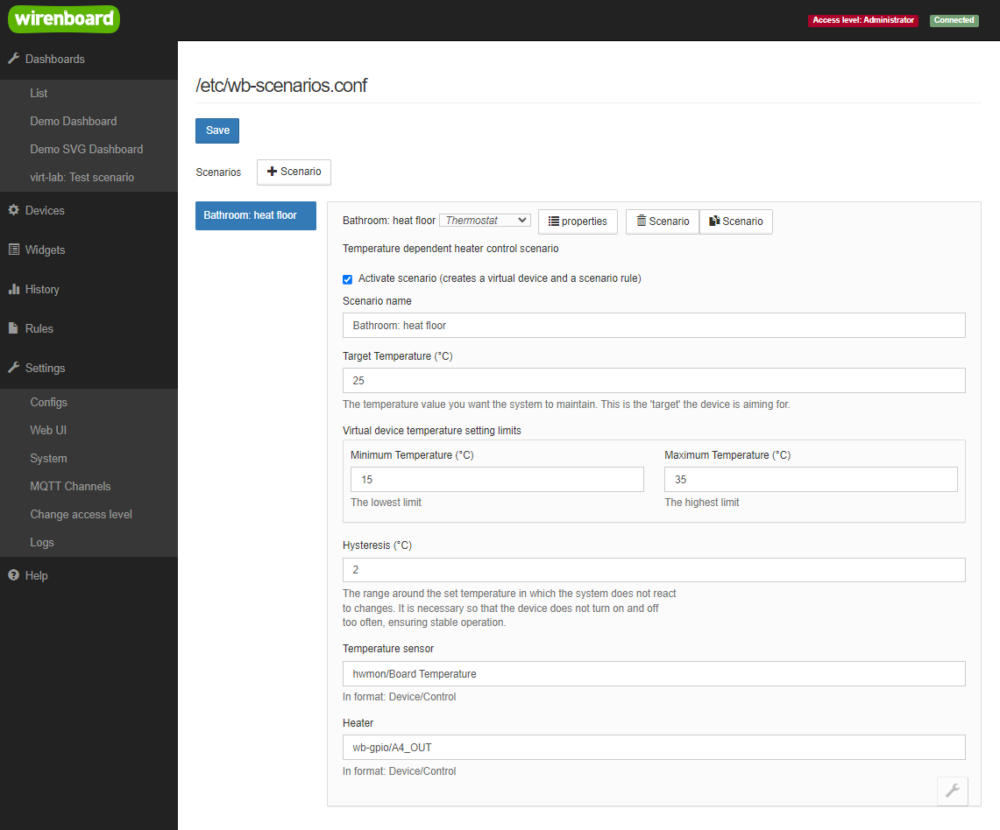
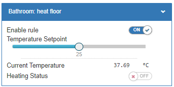
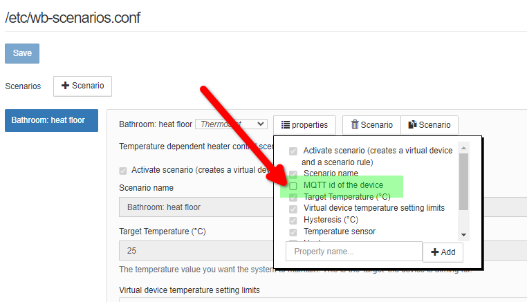

# Сценарий термостата `thermostat`

## Общее описание

Позволяет управлять нагревателями, например можно создать сценарий
управления теплым полом в ванной с названием `Bathroom: heat floor`

Конфигуратор сценария выглядит следующим образом:

<p align="center">
    
</p>

После сохранения сценария создается виртуальное устройство, подробнее ниже.

## Виртуальное устройство

С помошью виртуального устройства можно управлять созданным сценарием,
например изменять установленную температуру или отключать работу правила.
При отключении правила - нагреватель будет так же отключен.

### Внешний вид

Создаваемое сценарием виртуальное устройство выглядит следующим образом:

<p align="center">
    
</p>

### Заголовок (Title)

Название виртуального устройства будет такой же как имя
созданного вами сценария

### Имя (Name) устройства

Задается из двух частей:

1) `wbsc_ ` - статичный префикс всех устройств созданных для сценариев
2) Вторая часть может быть задана двумя вариантами
   - Имя сценария указанное при его создании, транслитерированное, в котором
     все буквы приведены в нижний регистр, а все символы кроме нижнего
     подчеркивания заменены на нижнее подчеркивание
   - Заданное напрямую не обязательным параметром `idPrefix`

При создании сценария с именем `Bathroom: heat floor` - создается
виртуальное устройство с именем `wbsc_bathroom__heat_floor`.
Двройное подчеркивание обусловленно наличием двоеточия, которое заменено на
нижнее подчеркивание при транслитерации.

Если вы хотите задать префикс виртуального устройства отличающийся от имени
вашего сценария - вы можете активировать такую возможность в свойствах.
Если это поле пустое или отсутствует в конфигурации, то префикс создается
с помошью транслитерации.

<p align="center">
    
</p>

### Список контролов

У виртуального устройства есть следующие контролы:

- Переключатель статуса работы правила сценария
  Пример имени топика: `wbsc_bathroom__heat_floor/ruleEnabled`
- Заданная темпрература - то что задал пользователь:
  Пример имени топика: `wbsc_bathroom__heat_floor/targetTemperature`
- Текущая температура - отражает показания указанного в настройках датчика
  Пример имени топика: `wbsc_bathroom__heat_floor/currentTemperature`
- Статус нагрева (исполнительного устройства)
  Пример имени топика: `wbsc_bathroom__heat_floor/actuatorStatus`

## Использование модуля

Вы можете использовать модуль термостата для управления нагревом прямо
из своих правил `wb-rules`.

Для этого нужно сделать 3 шага:

1) Подключить модуль
2) Создать объект настроек где прописать что вы хотите использовать
3) Инициализировать алгоритм указав
   - Имя виртуального устройства
   - Созданный объект конфигурации

### Описание параметров конфигурации

Конфигурация имеет 7 параметров, из которых 1 необязательный.

ThermostatConfig:

1. `idPrefix` {string} Не обязательный префикс к имени для
   идентификации виртуального устройства и правила:
   - Если параметр указан, то ВУ и правило будут иметь имя вида
     `wbsc_<!idPrefix!>` и `wbru_<!idPrefix!>`
   - Если не указан (undefined), то правая часть создается методом
     транслитерации из имени переданного в `init()`
2. `targetTemp` {number} Целевая температура, заданная пользователем
3. `hysteresis` {number} Значение гистерезиса (диапазон переключения)
4. `tempLimitsMin` {number} Ограничение установки температуры снизу
5. `tempLimitsMax` {number} Ограничение установки температуры сверху
6. `tempSensor` {string} Имя топика входного контрола - отслеживаемый
   Пример: датчик температуры значение которого следует слушать
   'temp_sensor/temp_value'
7. `actuator` {string} Имя топика выходного контрола - управляемый
   Пример: выход реле которым следует управлять - 'relay_module/K2'

### Пример кода

```js
/**
 * @file: init-heating.js
 */

// Step 1: include module
var scenarioModule = require('thermostat.mod');

function main() {
  log.debug('Start init logic for: Bathroom light');

  // Step 2: Configure algorithm
  var cfg = {
    idPrefix: 'bathroom_floor',// Не обязательный параметр, можно не указывать
    targetTemp: 22,
    tempLimitsMin: 16,
    tempLimitsMax: 29,
    hysteresis: 2,
    tempSensor: 'wb-msw-v4_34/Temperature',
    actuator: 'wb-mr6cv3_127/K6',
  };

  // Step 3: init algorithm
  var isInitSuccess = scenarioModule.init('Bathroom: heat floor', cfg);
  if (!isInitSuccess) {
    log.error('Error: Init aborted for "idPrefix": {}', cfg.idPrefix);
    return;
  }

  log.debug('Initialization successful for "idPrefix": {}', cfg.idPrefix);
}

main();
```

После запуска скрипта у вас с устройствах появится новое устройство
для управления - которое будет аналогично тому, что вы можете создать через
визульный конфигуратор в WEBUI контроллера:

<p align="center">
    
</p>
