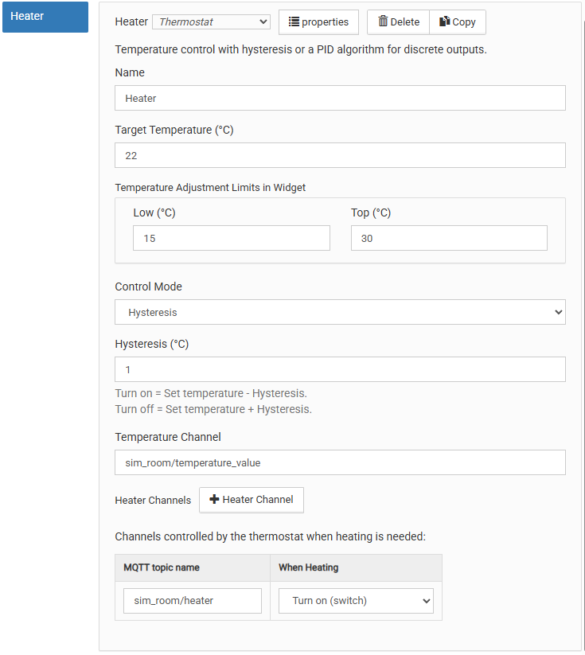
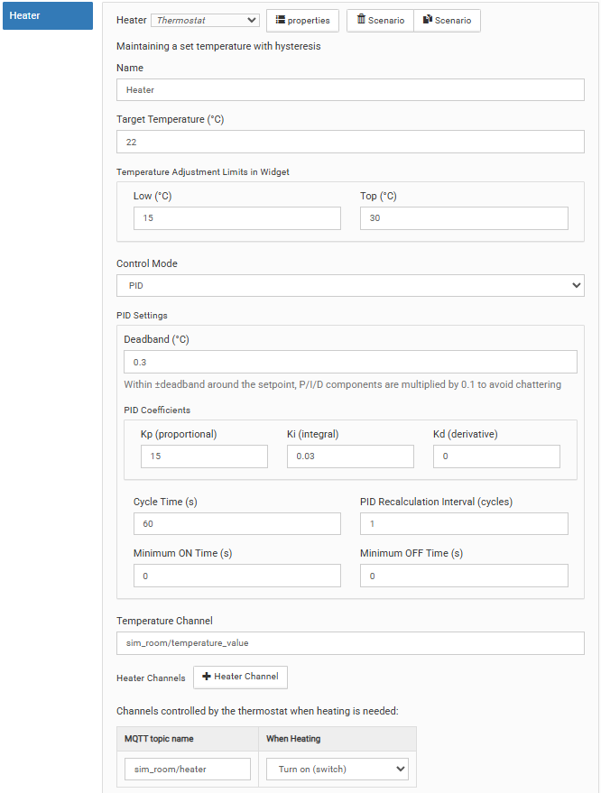
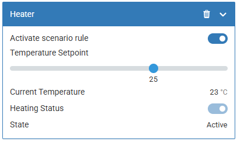
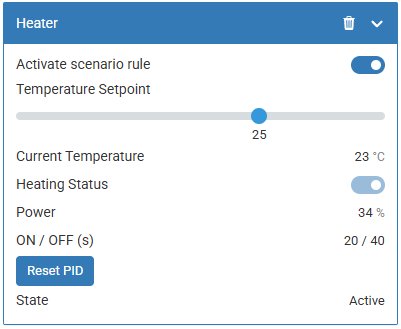
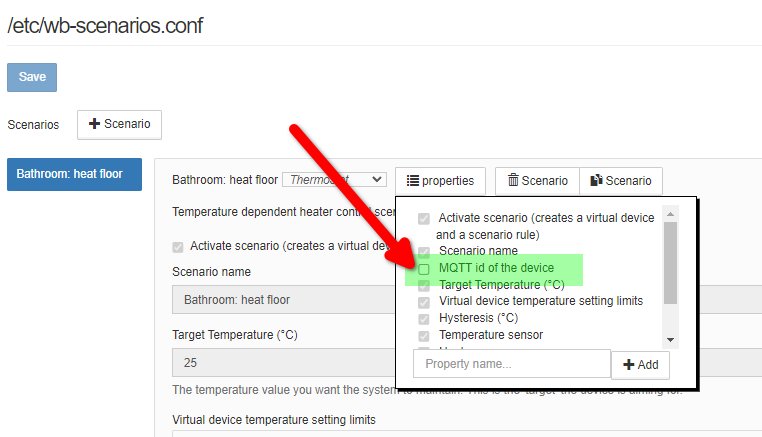

# Сценарий термостата `thermostat`

## Общее описание

Данный сценарий позволяет управлять нагревателями в двух режимах:

- Гистерезис — двухпозиционное регулирование с заданным гистерезисом;
- ПИД — пропорционально-интегрально-дифференциальное регулирование с широтно-импульсной модуляцией.

Конфигуратор сценария в режиме Гистерезис:

<p align="center">
    
</p>

Конфигуратор сценария в режиме ПИД:

<p align="center">
    
</p>

## Логика работы

После сохранения сценария создаётся виртуальное устройство — подробнее в отдельной секции ниже.

Сразу после инициализации:

Целевая температура берётся из конфигуратора, но её можно изменить с помощью
ползунка в виртуальном устройстве. Обогреватель включается или выключается в
зависимости от текущей температуры и выбранного режима.

### Режим гистерезиса (hysteresis)

Обогреватель работает по классическому гистерезису.

Например, при целевой температуре 22 °C и гистерезисе 2 °C обогреватель:

- Включится при достижении 20 °C = (22 целевая − 2 гистерезис)
- Выключится при достижении 24 °C = (22 целевая + 2 гистерезис)

### Режим ПИД (pid)

В этом режиме используется ПИД-регулятор, который непрерывно рассчитывает необходимую
мощность нагрева (0–100%). Мощность преобразуется во временные интервалы включения и
выключения внутри фиксированного периода.

#### Дополнительные настройки PID-режима:

- deadBand — зона нечувствительности вокруг уставки. Внутри неё П-, И- и Д-составляющие ослабляются, чтобы избежать микропереключений.
- pidCoefficients (Kp, Ki, Kd) — коэффициенты регулятора.
- pwmPeriodSec — период работы в секундах (целое число).
- pidRecalcCycles — как часто пересчитывать PID (каждые N циклов работы).
- minOnTimeSec / minOffTimeSec — минимальное время включения и выключения за период для защиты реле.

Пример: при мощности 70%, периоде 60 с и minOffTimeSec = 5 с, актуатор будет включён 42 с и выключен 18 с (но с учётом ограничений может быть скорректировано).

## Виртуальное устройство

С помошью виртуального устройства можно управлять созданным сценарием,
например изменять установленную температуру или отключать работу правила.
При отключении правила - нагреватель будет так же отключен.

### Внешний вид

Создаваемое сценарием виртуальное устройство в режиме Гистерезис:

<p align="center">
    
</p>

Создаваемое сценарием виртуальное устройство в режиме ПИД:

<p align="center">
    
</p>

### Заголовок (Title)

Название виртуального устройства будет такой же как имя
созданного вами сценария

### Имя (Name) устройства

Задается из двух частей:

1. `wbsc_ ` - статичный префикс виртуальных устройств созданных для сценариев
2. Вторая часть может быть задана двумя вариантами:
   - Транслитерированнием имени сценария указанного при его создании.
     В имени все буквы приводятся в нижний регистр, а все символы кроме
     подчеркивания `_` заменены на знак подчеркивания `_`
   - Заданное напрямую, с помошью не обязательного параметра `idPrefix`.

     Если вы хотите задать в WEBUI префикс виртуального устройства
     отличающийся от имени вашего сценария - вы можете активировать
     такую возможность в свойствах сценария как показано ниже:

     <p align="center">
         
     </p>

     Если это поле отсутствует в конфигурации или пустое, то префикс
     создается с помошью транслитерации.

     При использовании модуля термостата в скриптах - данный параметр
     указывается дополнительно в объекте конфигурации.

Пример сформированного имени виртуального устройства:

При создании сценария с именем `Bathroom: heat floor` - создается
виртуальное устройство с именем `wbsc_bathroom__heat_floor`.
Двойное подчеркивание обусловленно наличием двоеточия, которое заменено на
нижнее подчеркивание при транслитерации.

### Список контролов

У виртуального устройства есть следующие контролы:

- Переключатель статуса работы правила сценария
  Пример имени топика: `wbsc_bathroom__heat_floor/rule_enabled`
- Заданная темпрература (в градусах Цельсия):
  Этот параметр задает пользователь через WEBUI в целых градусах
  Пример имени топика: `wbsc_bathroom__heat_floor/target_temperature`
- Текущая температура (в градусах Цельсия):
  Отражает текущие показания датчика, который был указан в настройках
  Пример имени топика: `wbsc_bathroom__heat_floor/current_temperature`
- Статус нагрева (исполнительного устройства)
  Пример имени топика: `wbsc_bathroom__heat_floor/actuator_status`

Дополнительные контролы в режиме PID:

- Мощность (output_power) — выход ПИД-регулятора в процентах (0–100%), только для чтения.
  Пример: wbsc_bathroom\_\_heat_floor/output_power
- Длительности цикла (output_timing) — строка вида "on / off", показывающая расчётное время включения и выключения в текущем периоде работы (в секундах). Только для чтения.
  Пример: wbsc_bathroom\_\_heat_floor/output_timing
- Сброс ПИД (pid_reset) — кнопка для обнуления интегральной суммы ПИД-регулятора и перезапуска цикла.
  Пример: wbsc_bathroom\_\_heat_floor/pid_reset

## Использование модуля

Вы можете использовать модуль термостата прямо из своих
правил `wb-rules`. Для этого нужно сделать 4 шага:

1. Импортировать класс кастомного сценария
2. Создать новый инстанс класса "термостат"
3. Создать объект настроек где прописать что вы хотите использовать:
   - общие настройки целевой температуры и тд
   - топики которые вы хотите использовать для датчика и нагревателя
4. Инициализировать алгоритм указав:
   - Имя виртуального устройства
   - Созданный объект конфигурации

### Описание параметров конфигурации

Конфигурация содержит обязательные и опциональные параметры в зависимости от выбранного режима.

Общие параметры ThermostatConfig (для обоих режимов):

1. `idPrefix` {string} Не обязательный параметр
   Задает строку префикса добавляемого к идентификаторам
   виртуального устройства и правила:
   - Если параметр указан, то вирт. устройство и правило будут иметь
     одинаковые имена вида `wbsc_<!idPrefix!>`
   - Если не указан (`undefined`), то правая часть создается методом
     транслитерации из имени переданного в `init()`
2. `targetTemp` {number} Целевая температура, заданная пользователем
3. `tempLimitsMin` {number} Ограничение установки температуры снизу
4. `tempLimitsMax` {number} Ограничение установки температуры сверху
5. `tempSensor` {string} Имя топика отслеживаемого датчика
   Пример: датчик температуры значение которого следует слушать
   - 'wb-msw-v4_34/Temperature'
6. `actuators` {array} Список управляемых каналов
   Каждый элемент массива содержит:
   - `mqttTopicName` {string} Имя MQTT-топика управляемого контрола
     Пример: 'wb-mr6cv3_127/K6'
   - `behaviorType` {'setEnable'|'setDisable'} Тип поведения:
     - `setEnable` — включить при нагреве (нормальный режим)
     - `setDisable` — выключить при нагреве (инвертированная логика)
7. `controlMode` {'hysteresis' | 'pid'} Выбор алгоритма управления.

Параметры для режима `hysteresis`:

1. `hysteresis` {number} Значение гистерезиса (положительное число).

Параметры для режима `pid` (объект `pidSettings`):

1. `deadBand` {number} Зона нечувствительности (≥0).
2. `pidCoefficients` {object} Объект с полями kp, ki, kd (все ≥0).
3. `pwmPeriodSec` {number} Период работы в секундах (целое >0, должен быть > minOffTimeSec).
4. `pidRecalcCycles` {number} Пересчёт PID каждые N циклов работы (целое ≥1).
5. `minOnTimeSec` {number} Минимальное время включения за период (≥0).
6. `minOffTimeSec` {number} Минимальное время выключения за период (≥0).

### Пример кода (режим гистерезиса)

```js
/**
 * @file: init-heating.js
 */

// Step 1: import module
var CustomTypeSc = require('thermostat.mod').ThermostatScenario;

function main() {
  var scenarioName = 'Bathroom: heat floor';
  log.debug('Start init logic for: "{}"', scenarioName);

  // Step 2: Create new instance with scenario class
  var scenario = new CustomTypeSc();

  // Step 3: Configure algorithm
  var cfg = {
    idPrefix: 'bathroom_floor', // This is an optional parameter and can be omitted
    targetTemp: 22,
    tempLimitsMin: 16,
    tempLimitsMax: 29,
    hysteresis: 2,
    tempSensor: 'wb-msw-v4_34/Temperature',
    actuators: [
      { mqttTopicName: 'wb-mr6cv3_127/K6', behaviorType: 'setEnable' },
    ],
  };

  // Step 4: init algorithm
  try {
    var isInitSuccess = scenario.init(scenarioName, cfg);

    if (!isInitSuccess) {
      log.error('Init operation aborted for scenario: "{}"', scenarioName);
      return;
    }

    log.debug('Initialization successful for: "{}"', scenarioName);
  } catch (error) {
    log.error(
      'Exception during scenario initialization: "{}" for scenario: "{}"',
      error.message || error,
      scenarioName
    );
  }
}

main();
```

После запуска скрипта у вас с устройствах появится новое устройство
для управления - которое будет аналогично тому, что вы можете создать через
визульный конфигуратор в WEBUI контроллера:

<p align="center">
    
</p>

### Пример кода (режим PID)

```
var CustomTypeSc = require('thermostat.mod').ThermostatScenario;

function main() {
  var scenarioName = 'Living room PID';
  var scenario = new CustomTypeSc();

  var cfg = {
    idPrefix: 'living_pid',
    targetTemp: 23,
    tempLimitsMin: 18,
    tempLimitsMax: 28,
    controlMode: 'pid',
    pidSettings: {
      deadBand: 0.5,
      pidCoefficients: { kp: 30, ki: 0.5, kd: 10 },
      pwmPeriodSec: 60,
      pidRecalcCycles: 1,
      minOnTimeSec: 5,
      minOffTimeSec: 5,
    },
    tempSensor: 'wb-msw-v4_34/Temperature',
    actuators: [
      { mqttTopicName: 'wb-mr6cv3_127/K6', behaviorType: 'setEnable' },
    ],
  };

  var isInitSuccess = scenario.init(scenarioName, cfg);
  if (!isInitSuccess) {
    log.error('Init failed for "{}"', scenarioName);
  }
}

main();
```

После запуска скрипта у вас с устройствах появится новое устройство
для управления - которое будет аналогично тому, что вы можете создать через
визульный конфигуратор в WEBUI контроллера:

<p align="center">
    
</p>
