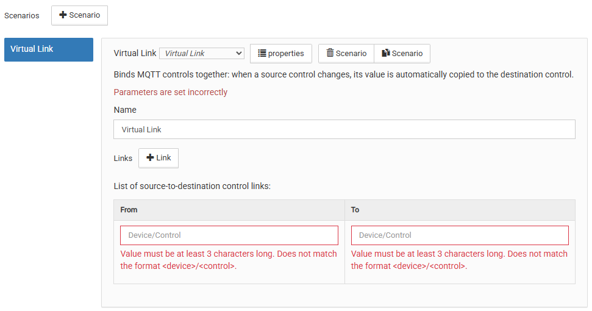
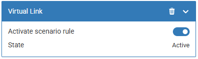

# Сценарий виртуальной связки `virtualLink`

## Общее описание

Сценарий создаёт программные связи между MQTT-контролами.
При изменении значения source-контрола оно автоматически
копируется в destination-контрол.

Типичные применения:

- Программная привязка выключателя к реле (вместо аппаратной)
- Зеркалирование показаний датчика на панель или дисплей
- Прокидывание значений между устройствами разных протоколов
  (Zigbee → Modbus)

Конфигуратор сценария выглядит следующим образом:

<p align="center">
    
</p>

## Логика работы

### Связки (links)

Сценарий содержит массив связок, каждая из которых определяет
пару source → destination. При изменении source значение
копируется в destination как есть, без трансформаций.

Несколько связок могут иметь один и тот же source — все
соответствующие destination получат значение одновременно.

### Начальная синхронизация

При запуске или перезапуске wb-rules сценарий однократно
считывает текущие значения всех source и копирует их
в destination. Это гарантирует консистентность после рестарта.

При повторном включении (`rule_enabled`) также выполняется
синхронизация — значения source, изменившиеся пока сценарий
был выключен, копируются в destination.

### Проверка типов

При инициализации сценарий сравнивает типы source и destination.
Если типы отличаются — в лог пишется предупреждение (warning).
Сценарий при этом не блокируется.

### Защита от петель

- **Прямая петля** (`source === destination`) — связка
  отклоняется при валидации
- **Непрямая петля** (A→B + B→A в одном сценарии) —
  обнаруживается и отклоняется при валидации
- Кросс-сценарные петли не проверяются

### Состояние (`state`)

| Значение | Описание |
|---|---|
| **Активен** | Включён, все контролы доступны |
| **Ожидает** | Включён, ожидание доступности контролов |
| **Отключен** | Сценарий выключен (`rule_enabled = false`) |

---

## Параметры конфигурации

### Наименование (`name`)

Имя сценария, используется как заголовок виртуального устройства.
Максимум 30 символов.

### Связки (`links`)

Массив связок source → destination. Минимум 1 элемент.

| Поле | Тип | Описание |
|---|---|---|
| `source` | string | Топик источника: `устройство/контрол` |
| `destination` | string | Топик приёмника: `устройство/контрол` |

---

## Пример конфигурации

### Привязка выключателя к реле

```json
{
  "scenarioType": "virtualLink",
  "componentVersion": 1,
  "name": "Выключатель → Реле",
  "links": [
    {
      "source": "wb-gpio/A1_OUT",
      "destination": "wb-gpio/A2_OUT"
    }
  ]
}
```

### Зеркалирование датчика на несколько приёмников

```json
{
  "scenarioType": "virtualLink",
  "componentVersion": 1,
  "name": "Датчик на панель",
  "links": [
    {
      "source": "wb-msw-v4_34/Temperature",
      "destination": "panel/display_temp"
    },
    {
      "source": "wb-msw-v4_34/Humidity",
      "destination": "panel/display_hum"
    }
  ]
}
```

---

## Виртуальное устройство

Сценарий создаёт виртуальное устройство `wbsc_<idPrefix>` с контролами:

| Контрол | Тип | Описание |
|---|---|---|
| `rule_enabled` | switch | Включение/выключение сценария |
| `state` | value | Состояние: «Активен» / «Ожидает» / «Отключен» |

### Внешний вид

Создаваемое сценарием виртуальное устройство выглядит следующим образом:

<p align="center">
    
</p>

---

## Особенности использования

1. **Readonly destination:** запись в readonly-контролы виртуальных
   устройств wb-rules работает без ошибок. Readonly блокирует только
   изменение через UI, программная запись проходит штатно.

2. **Перезапуск wb-rules:** при перезапуске сценарий переинициализируется,
   подписки восстанавливаются, начальная синхронизация копирует текущие
   значения source в destination.

3. **Частые изменения source:** каждое изменение приводит к копированию.
   Throttle не применяется — это ожидаемое поведение.

---

## Использование модуля

Вы можете использовать модуль виртуальной связки напрямую из своих
правил `wb-rules`. Для этого нужно сделать 4 шага:

1) Импортировать класс `VirtualLinkScenario`
2) Создать новый экземпляр класса
3) Создать объект настроек
4) Инициализировать сценарий, передав имя и конфигурацию

### Описание параметров конфигурации

`VirtualLinkConfig`:

1. `idPrefix` {string} — необязательный. Префикс MQTT-имён виртуального
   устройства и правил. Если не указан, генерируется транслитерацией из имени.
2. `links` {array} — массив связок. Минимум 1 элемент. Каждый элемент:
   - `source` {string}: топик источника `'device/control'`
   - `destination` {string}: топик приёмника `'device/control'`

### Пример кода

```js
/**
 * @file: init-link.js
 */

// Step 1: import module
var CustomTypeSc =
  require('virtual-link.mod').VirtualLinkScenario;

function main() {
  var scenarioName = 'Switch to relay';

  // Step 2: create instance
  var scenario = new CustomTypeSc();

  // Step 3: configuration
  var cfg = {
    idPrefix: 'switch_relay',
    links: [
      {
        source: 'wb-gpio/A1_OUT',
        destination: 'wb-gpio/A2_OUT',
      },
    ],
  };

  // Step 4: init algorithm
  try {
    var isInitSuccess = scenario.init(scenarioName, cfg);

    if (!isInitSuccess) {
      log.error('Init failed for: "{}"', scenarioName);
      return;
    }

    log.debug('Init successful for: "{}"', scenarioName);
  } catch (error) {
    log.error(
      'Exception during init: "{}" for: "{}"',
      error.message || error,
      scenarioName
    );
  }
}

main();
```
