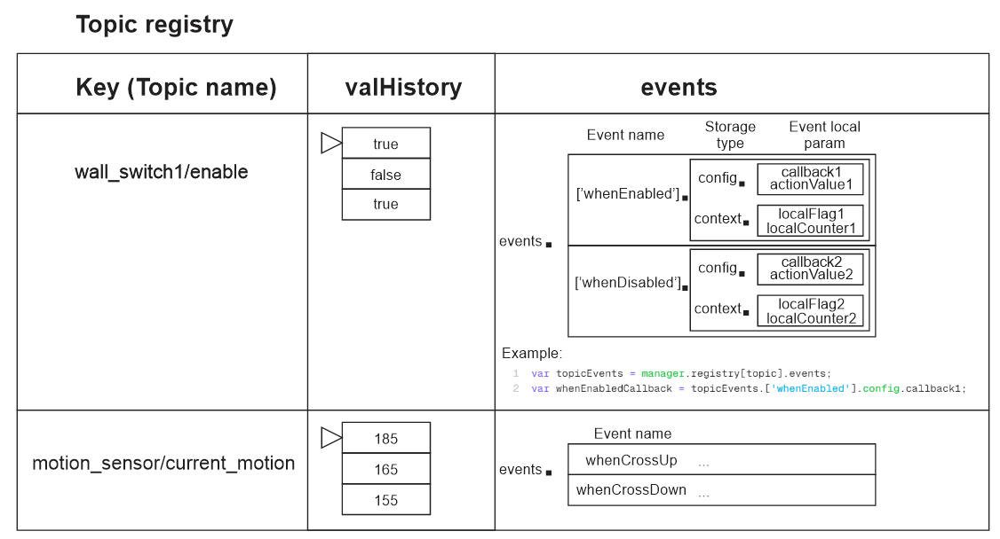

# Руководство по модулю топик менеджера [TM/Topic Manager]

Основная идея TM - вместо того чтобы каждый раз придумывать заново
структуру хранения данных для каждого скрипта wb-rules: предоставить
типовую структуру данных и часто используемые методы работы со структурами
данных которые полезны при работе с правилами `wb-rules`. Идейно TM похож
на фраемворк для веб разработки, но созданный для работы с `wb-rules`.

Важно - базовый модуль топик менеджера почти не имеет полезного функционала.
Для добавления полезного функционала нужно подключать соответствующие плагины
такие как historyPlugin и eventPlugin.

В базе TM имеет только функционал управления правилами - можно добавлять
правила внутрь объекта `this.rules = {};`. Далее можно управлять ими
с помошью методов `tm.disableAllRules()` и `tm.enableAllRules()`.

Топик менеджер позволяет решать задачи начального уровня проще,
так как предоставляет возможность детектировать разные именованные
события топика (плагин событий) и дает другие вспомогательные инструменты,
например создает виртуальное устройство для контроля используемых топиков
и включения/отключения созданного правила и отображения ошибки
при необходимости.

При работе с TM - вся информация о правилах и используемых топиках
собирается в одном локальном объекте внутри каждого правила.

```javascript
var tm = new TopicManager();
```

Далее с помошью этого объекта можно удобно управлять сущностями, например:

- Все созданные правила юзера можно отключить одним вызовом (базовая функция)
- Найти историю значений используемых топиков и зарегистрированных
событий для каждого топика (плагин history)
- Зарегистрировать для топиков именованные события (плагин events)

Так же предоставляет вспомогательные средства для разработки и отладки
своих правил - например для TM с помощью плагина basicVd можно создать
правило которое поможет включать и выклдчать обработку пользовательских
событий - TM сам проанализирует какие вы создавали правила и с какими
топиками, создав нужное виртуальное устройство куда вы уже сможете добавить
нужные вам контролы для взаимодействия.

## Общее описание

Модуль топик менеджера помогает создать реестр топиков с которыми вам нужно
работать и решать три главные задачи:

1) Гибко обрабатывать плагинами через tm.runProcessors()
   Для этого есть гибкая цепь обработки куда плагины могут добавлять свои
   процессоры в цепочку - pluginsProcessorsChain[] в базовом объекте.
   Например:
   - Плагин истории значений добавляет процессор запоминиющий в массив
     приходящие значения топиков
   - Последующий процессор событий может исопльзовать эти данные для
     детектирования именованных событий, например whenEnabled,
     whenDisabled и тд.
   Польза - подключая новые плагины можно добавлять функционал не меняя код
   правила.

2) Хранить данные относящиеся к топикам централизованно на протяжении работы
   вашего правила wb-rules.
   Для этого есть реестр топиков. Под данными понимается любая информация,
   флаги, состояния, таблицы и тд - то есть что может быть необходимо
   в работе.
   Например:
   - При подключении расширения event можно для каждого из топиков хранить
     отдельные обработчики (callback) конкретных именованных событий, типа
     whenEnabled, whenDisabled и тд.
     (@todo: реализация плагина истории значений позволит реализовать более
     сложные типы именованных событий, например: whenCrossUpperThenValue,
     whenCrossDownThenValue и тд)
   Польза - из коробки имеем структуру данных для хранения стандартной или
   кастомной информации о статусе топиков и настроек работы с ними.

3) Создание и управление одним правилом для всех используемых топиков.
   После того как вы добавили топики в реестр - создается одно правило
   и управление топиками переходит топик менеджеру.

4) Получение пользы от плагинов.
   Например плагин событий позволяет кратко записывать создание разных
   обработчиков для разных типов событий.

## Использование

### 1. Подключение TM и плагинов

TM и плагины являются модулями и находятся глобально из любого скрипта.

```javascript
var TopicManager = require('tm-main.mod').TopicManager;
var eventPlugin = require('tm-event-main.mod').eventPlugin;
var historyPlugin = require('tm-history-main.mod').historyPlugin;
```

### 2. Создание объекта топик менеджера

Удобно пользоваться одним объектом TM на один скрипт чтобы у всех топиков
и событий был один контекст выполнения, но при необходимости - в одном скрипте
можно создать один или больше объектов топик менеджера, каждый из которых
будут независимыми друг от друга.

```javascript
var tm = new TopicManager();
```

### 3. Установка плагинов в созданный объект TM

Обратите внимание что порядок важен так как в плагине eventPlugin
есть зависимость `eventPlugin.dependencies: ['historyPlugin']`:

```javascript
tm.installPlugin(historyPlugin);
tm.installPlugin(eventPlugin);
```

### 4. Использование функционала

#### 4.1. Работа с правилами

Внутри TM работа с правилами основана на взаимодействии с реестром
правил `tm.rules{}`, внутри которого сохраняются все созданные правила.
У каждого правила есть его режим работы mode - он может быть двух видов:

- `general` - реестр общих пользовательских правил
- `service` - реестр сервисных правил которые не отключаются

Есть два метода которые нужно использовать как внутри TM так и снаружи для
добавления правил в один из реестров:

- `tm.defineRule()` - создает правило и добавляет его в реестр `rules`
  Отличается от обычного `defineRule()` только тем что автоматически
  сохраняет информацию о созданном правиле в локальный реестр.
- `tm.defineServiceRule()` - создает сервисное правило помечая его
  mod равным `service`

Сервисные правила TM отличаются от обычных тем что на них не действуют методы
`tm.disableAllRules()` и `tm.enableAllRules()`

#### 4.2. Инициализация событий топиков

Для использования событий - можно настроить детектирование событий следующим
образом:

```javascript
function cbFuncDisabled(topic, event) {
  log.debug('Run cbFuncDisabled()');
  return true;
}

function cbFuncCrossUpper(topic, event) {
  log.debug('Run cbFuncCrossUpper()');
  return true;
}

function cbFuncCrossLower(topic, event) {
  log.debug('Run cbFuncCrossLower()');  
  return true;
}

tm.registerSingleEvent('wall_switch_9/enabled', 'whenDisabled', cbFuncDisabled);
tm.registerSingleEvent('vd-water-meter-1/litres_used_value', 'whenCrossUpper', cbFuncCrossUpper, {actionValue: 15});
tm.registerSingleEvent('vd-water-meter-1/litres_used_value', 'whenCrossLower', cbFuncCrossLower, {actionValue: 17});
```

### 5. Создание и запуск правила

После инициализации всех топиков нужно выбрать один из типов запуска
правила с топик менеджером - самый простой способ, это запустить правило:

При использовании initRulesForAllTopics() будет создано правило которое
отслеживает изменение всех настроенных ранее топиков с указанным именем:

```javascript
tm.initRulesForAllTopics('GenRuleName');
```

### 6. Создание виртуального девайса (Опционально)

(TODO: Реализовать этот фукнционал)

Для облегчения работы с топик менеджером можно создать виртуальное устрйоство
которое поможет

- Включать/выключать все правила TM. Например для веременной остановки
  работы алгоритмов. Например используется в сценариях для остановки работы
  сценария.
- В режиме дебага отслеживать текущее состояние всех привязанных контролов

### 7. Управление правилом

Созданное ранее правило можно отключить, включить или запустить принудительно.

Пример:

```javascript
tm.rules['GenRuleName'].disable();
```

## Пример использования в правилах WB-rules

В данном примере при выключении топика `wall_switch_9/enabled` выполнится
функция `cbFuncDisabled()` в которой мы можем получить доступ к истории топика

```javascript
var TopicManager = require('tm-main.mod').TopicManager;
var eventPlugin = require('tm-event-main.mod').eventPlugin;
var historyPlugin = require('tm-history-main.mod').historyPlugin;
var basicVdPlugin = require('tm-basicvd-main.mod').basicVdPlugin;

var tm = new TopicManager();

// Установка плагинов
// Обратите внимание что порядок важен
// так как в eventPlugin.dependencies: ['historyPlugin']
tm.installPlugin(historyPlugin);
tm.installPlugin(eventPlugin);
tm.installPlugin(basicVdPlugin);

// Более функциональный коллбек с доступом к истории значения с помошью плагина
// "topic" является расширяемым объектом которому можно добавить другие поля
function cbFuncDisabled(topic, event) {
  log.debug('Run cbFuncDisabled()');
  log.debug('- Topic name: "' + topic.name + '"');
  log.debug('- New value: "' + topic.val.new + '"');
  log.debug('- Prev value: "' + topic.val.prev + '"');
  log.debug(
    '- Value history: ' + JSON.stringify(topic.val.history, null, 2)
  );
  log.debug('- Event type: "' + event.type + '"');
  return true;
}

function cbFuncCrossUpper(topic, event) {
  log.debug('Run cbFuncCrossUpper()');
  log.debug('- Topic name: "' + topic.name + '"');
  log.debug('- New value: "' + topic.val.new + '"');
  log.debug('- Prev value: "' + topic.val.prev + '"');
  log.debug(
    '- Value history: ' + JSON.stringify(topic.val.history, null, 2)
  );
  log.debug('- Event type: "' + event.type + '"');
  return true;
}

function cbFuncCrossLower(topic, event) {
  log.debug('Run cbFuncCrossLower()');
  log.debug('- Topic name: "' + topic.name + '"');
  log.debug('- New value: "' + topic.val.new + '"');
  log.debug('- Prev value: "' + topic.val.prev + '"');
  log.debug(
    '- Value history: ' + JSON.stringify(topic.val.history, null, 2)
  );
  log.debug('- Event type: "' + event.type + '"');

  // Управлять правилами TM можно двумя способами
  // - Конкретное правило по имени
  tm.rules['GenRuleName'].disable();
  // - Все правила пользователя (не отключит сервисные правила)
  tm.disableAllRules();
  // Далее мы сможем включить отключенные правила переключателем
  // виртуального девайса (так как оно сервисное)
  

  return true;
}

function main() {
  // Регистрация событий - "когда выключится" и "когда пересечет границу вверх"
  tm.registerSingleEvent(
    'wall_switch_9/enabled',
    'whenDisabled',
    cbFuncDisabled
  );
  tm.registerSingleEvent(
    'vd-water-meter-1/litres_used_value',
    'whenCrossUpper',
    cbFuncCrossUpper,
    { actionValue: 15 }
  );
  tm.registerSingleEvent(
    'vd-water-meter-1/litres_used_value',
    'whenCrossLower',
    cbFuncCrossLower,
    { actionValue: 17 }
  );

  // Создаем виртуальное базовое виртуальное устройство
  // которое может управлять правилом TM (отключать/включать)
  tm.initVirtualDevice('my_dev', 'Мое устройство кульное');
  
  // Так же можем выставлять ошибку виртуального устройства - все контролы станут красными
  tm.vd.setError('Hello');

  // Для особо опасных состояний можно создать аларм
  tm.vd.addAlarm('Ошибка');
  
  // И добавлять другие контролы - например добавить аларм в рантайм
  tm.vd.addCell('test_cell', {
    title: {
      en: 'cellTitleEn',
      ru: 'cellTitleRu',
    },
    type: 'alarm',
    readonly: true,
    value: true,
  });

  // Если сильно хочется работать с девайсом старыми способами - то можно либо получить имя, либо сразу объект
  log.debug('Виртуальное устройство с именем: "{}"', tm.vd.name)
  tm.vd.devObj.addControl('test_text', {
    title: {
      en: 'cellTitleTextEn',
      ru: 'cellTitleTextRu',
    },
    type: 'Text',
    readonly: true,
    value: 'Новое поле',
  });
  

  // Генерация и запуск правила TM для начала работы
  // Созданное правило будет
  // - Обрабатывать все сконфигурированные ранее события для топиков
  // - При детектировании события вызывать коллбеки юзера
  tm.initRulesForAllTopics('GenRuleName');
}

main();
```

## Внутренности реализации

### Структура реестра топиков

Ниже иллюстрация структуры - того как должен выглядеть объект при добавлении
двух плагинов.



Пример доступа к такого рода объектам которые были добавлены плагинами:

```javascript
var topicEvents = manager.topics[topic].events;
var whenEnabledCallback = topicEvents.['whenEnabled'].config.callback1;

var history = manager.topics[topic].valHistory;
```

Внутри объекта возвращаемого createTopicManager() содержится две сущности:

1) Реестр топиков - который хранит всю информацию которая связана с топиками
2) Глобальные методы обработки данных топиков - например после инициализации
   расширения для работы с событиями появляются методы регистрации собития по
   его имени - `eventMgr.registerSingleEvent()`

Новые методы для работы с топиками должны добавляться именно в корень объекта
это позволяет намного проще реализовывать расширения топик менеджера и не
обходить все дочерние объекты в случае добавления новых методов к ним.

Структура решения поддерживает расширения и состоит из нескольких файлов:

- tm-main.mod.js - базовый модуль который содержить только базовый объект
- tm-event-main.mod.js - расширение для событий
- tm-event-resolvers.mod.js - резолверы для событий
- tm-history-main.mod.js - расширение для истории событий (@todo)

### Хранилища правил

У topic-manager есть два хранилища правил:

1) Хранилище пользовательских правил которым можно и нужно управлять извне.
   Сюда добавляются правила двух типов
   - Создаваемые при настройке событий - с помошью которых происходит работа
   с пользовательскими callback функциями.
   - Создаваемые напрямую с помошью tm.defineRule()

2) Хранилище сервисных правил - внутрь которого кладутся все вспомогательные
   правила необходимые для работы topic-manager и его плагинов.
   Например: там находится правило базового виртуального девайса для запуска
   и остановки пользовательских правил. Если данное правило будет отключено
   при выполнении tm.disableAllRules() когда сработает callback по изменению
   свича VD управляющего работой правил, то включить правила уже не получится.
