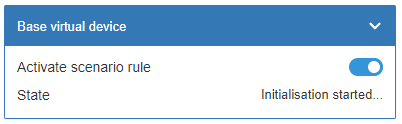
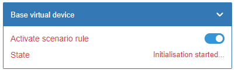
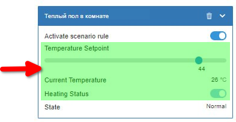
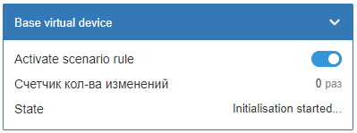
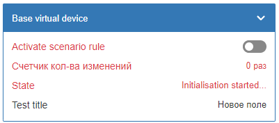

# ScenarioBase

ScenarioBase - базовый класс для создания сценариев

## 1. Зачем нужен

Данный класс нужен для упрощения создания новых сценариев и стандартизации\
кода и внешнего вида. Если точнее то для нескольких целей:

1) Изолирует контекст выполнения каждого сценария\
   Это самая важная причина необходимости обертки каждого сценария в объект.

2) Имеет основной функционал нужный каждому сценарию
   - Создает базовое виртуальное устройство
   - Дает возможность включения и выключения сценария
   - Сам выставляет начальный и конечный этапы инициализации в устройстве
   - TODO:(vg) Дает возможность простого начального ожидания создания топиков
     перед началом работы сценария (пока initSpecific() вызывается не ожидая).

3) Делит работу сценария на этапы для упрощенной поддержки\
   Функция init() которая вызывается пользователями определена в базовом\
   классе - пользователям нужно только переопределить несколько методов\
   при создании сценария. Это делает струкруру новых сценариев предсказуемой\
   и проще сопровождаемой.

4) Дает вызывающему коду более простой контроль над созданым сценарием\
   Для того чтобы отключить сценарий - не нужно знать имя его виртуального\
   устройства - можно просто написать:

   ```js
   scenario.disable();
   ```

## 2. Виртуальное устройство

### 2.1. Контролы

При создании наследника от базового класса - сразу создается базовое\
виртуальное устройство состояшее из двух элементов:

- Переключатель вкл/выкл сценарий. Всегда добавляется наверх (order: 1)\
  Нужен чтобы вручную или из любых скриптов отключать работу сценария,\
  под капотом этот ползунок выключает все правила созданные сценарием.

- Статус сценария. Всегда добавляется в самый низ (order: 100)\
  Нужен чтобы отображать статусы ожидания и успешной инициализации явно.

- Все добавляемые кастомным сценарием контролы должны иметь порядок\
  между этими двумя базовыми контролами (order: 2-99). Но сценарий не\
  обазательно должен создавать кастомные контролы если они ему не нужны\
  для простых сценариев будет достаточно базового виртуального устройства.

### 2.2. Внешний вид

Базовое виртуальное устройство, если ваш сценарий его не изменяет выглядит
следующим образом:



Виртуальное устройство создается еще до того как был запушен процесс
инициализации вашего сценария для того чтобы в случае ошибок при инициализации
можно было отобразить все в виртуальном устройстве, для этого есть два метода

1) В случае ошибок можно установить тотальную ошибку на все устрйоство - тем
  самым дать понять человеку что сценарий не работает корректно. При ошибке
  все контролы веделется красным светом.

    

2) В случае долгой инициализации можно выставить статус ожидания в поле `State`
  данное поле является enum и статусы должны быть общами для всех сценариев
  поэтому добавлять новые статусы в него нужно осторожно.

Пример базового устройства, которое было измененно кастомным сценарием
термостата - 4 контрола по середине были добавлены.



## 3. Базовое использование и пример

Создание сценария происходит в два этапа:

 1) Создание класса сценария, наследующего от `ScenarioBase`
    Желательно создавать класс в отдельном файле модуля для повторного
    использования другими скриптами
 2) Инициализация и запуск сценария
    Инициализация и запуск должна быть вынесена в отдельный файл
    скрипта wb-rules

Для создания кастомного сценария наследованного от ScenarioBase нужно
реализовать несколько методов в вашем дочернем классе:

- validateCfg(cfg) - проверка конфигурации
- initSpecific() - специфическая инициализация
- generateNames(idPrefix) - генерация имен для объектов сценария

Ниже пример илюстрирующий порядок использования базового класса для создания
нового сценария который считает изменения указанного контрола и выводит
колличество изменений в виртуальном устройстве:

### 3.1. cenario-custom.mod.js - файл модуля кастомного сценария

```js
var ScenarioBase = require('wbsc-scenario-base.mod').ScenarioBase;
var log = new (require('logger.mod').Logger)('test-scenario');

// = = = Три строчки ниже - это наследование в js ES5 = = =
function CustomScenario() { ScenarioBase.call(this); }
CustomScenario.prototype = Object.create(ScenarioBase.prototype);
CustomScenario.prototype.constructor = CustomScenario;

// = = = Ниже реализация необходимых для работы методов = = =
CustomScenario.prototype.generateNames = function (idPrefix) {
  return {
    vDevice: 'wbsc_' + idPrefix
  };
};

CustomScenario.prototype.validateCfg = function (cfg) {
  // Проверка конфигурации, например, наличия обязательных полей
  if (!cfg.controlTopic) {
    log.error('Отсутствует обязательный параметр "controlTopic"');
    return false;
  }
  return true; // В случае успеха нужно вернуть true
};

CustomScenario.prototype.initSpecific = function () {
  log.info('Инициализация пользовательского сценария');

  // Добавляем счетчик изменений в виртуальное устройство
  this.vd.devObj.addControl('change_counter', {
    title: 'Счетчик кол-ва изменений',
    type: 'value',
    value: 0,
    units: 'раз',
    forceDefault: true,
    order: 2
  });

  // Настройка правила для отслеживания изменений
  var self = this;
  ruleId = defineRule({
    whenChanged: self.cfg.controlTopic,
    then: function(newValue) {
      // Получаем текущее значение счетчика
      var ctrl = self.vd.devObj.getControl('change_counter')
      var currentCount = ctrl.getValue();
      log.info('Изменений сейчас: "{}"', currentCount);
      
      // Увеличиваем счетчик на 1
      currentCount++;
      
      // Обновляем значение в виртуальном устройстве
      ctrl.setValue(currentCount);
      
      log.info('Зафиксировано изменение контрола ' + self.cfg.controlTopic + 
               ' (всего изменений: ' + currentCount + ')');
    }
  });

  this.addRule(ruleId); // Добавляем правила которые управляются в виртуальном устройстве

  return true;  // В случае успеха нужно вернуть true
};

exports.CustomScenario = CustomScenario;
```

### 3.2. scenario-init-custom.mod.js - файл инициализации кастомного сценария

Данный скрипт создаст:

- Виртуальное устройство с id `wbsc_base_virtual_device`.\
  id так как не задан в конфиге - тринслитерирован из имени сценария.
- Контрол выключения с именем топика `wbsc_base_virtual_device/rule_enabled`
- Контрол отображения статуса `wbsc_base_virtual_device/state`

```js
var CustomScenario = require('scenario-custom.mod').CustomScenario;
var ScenarioState = require('wbsc-scenario-base.mod').ScenarioState;
var log = new (require('logger.mod').Logger)('test-scenario-init');

var scenario = new CustomScenario();

// Инициализация с требуемыми параметрами
cfg = {
  controlTopic: 'wb-mr6cv3_127/K1',  // Топик контрола для отслеживания
}
scenario.init('Base virtual device', cfg);

// Использование методов созданного сценария
scenario.enable();
scenario.disable();
scenario.vd.setTotalError('Simulated error');

// Для модификации виртуального девайса можно использовать методы wb-rules
log.info(JSON.stringify(scenario.vd.devObj.controlsList(), null, 2));

scenario.vd.devObj.addControl('test_text', {
  title: 'Test title',
  type: 'text',
  value: 'Новое поле'
});

// При необходимости можно поменять состояние отображаемое в девайсе
scenario.setState(ScenarioState.CONFIG_INVALID);

log.info(JSON.stringify(scenario.vd.devObj.controlsList(), null, 2));
```

Если в конфиге установить префикс, то он будет указан а не транслитерирован:

```js
scenario.init('My test', { idPrefix: 'test_scn' });
```

Вызывать init без объекта конфига нельзя - он обязателен но может быть пуст
если он не нужен вашему сценарию. Это сделано чтобы не забывали его прокинуть.

```js
scenario.init('Base virtual device', {}); // Объект конфига обязателен
```

### 3.3. Внешние изменения


После того как будет инициализирован сценарий, то есть после строчки

```js
scenario.init('Base virtual device', cfg);
```

Виртуальное устройстово будет выглядеть так:



После выполнения всего кода в init скрипте виртуальное устройство изменится
и будет выглядеть так:


Верхний выключатель управляет статусом правил - и выключает/включает работу
сценарий. Так как в конечном состоянии сценарий выключен, то изменения
не считаются, для того чтобы начались считаться - нужно включить сценарий.
