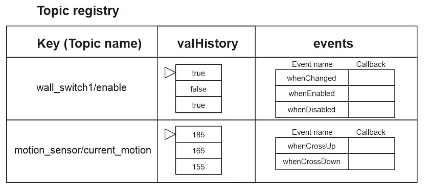

# Руководство по модулю топик менеджера (tm, topic manager)

## Общее описание

Модуль топик менеджера помогает создать реестр топиков с которыми вам нужно
работать и решать три главные задачи:

1) Гибко обрабатывать плагинами через tm.runProcessors()
   Для этого есть гибкая цепь обработки куда плагины могут добавлять свои
   процессоры в цепочку - pluginsProcessorsChain[] в базовом объекте.
   Например:
   - Плагин истории значений добавляет процессор запоминиющий в массив
     приходящие значения топиков
   - Последующий процессор событий может исопльзовать эти данные для
     детектирования именованных событий, например whenEnabled,
     whenDisabled и тд.
   Польза - подключая новые плагины можно добавлять функционал не меняя код
   правила.

2) Хранить данные относящиеся к топикам централизованно на протяжении работы
   вашего правила wb-rules.
   Для этого есть реестр топиков. Под данными понимается любая информация,
   флаги, состояния, таблицы и тд - то есть что может быть необходимо
   в работе.
   Например:
   - При подключении расширения event можно для каждого из топиков хранить
     отдельные обработчики (callback) конкретных именованных событий, типа
     whenEnabled, whenDisabled и тд.
     (@todo: реализация плагина истории значений позволит реализовать более
     сложные типы именованных событий, например: whenCrossUpperThenValue,
     whenCrossDownThenValue и тд)
   Польза - из коробки имеем структуру данных для хранения стандартной или
   кастомной информации о статусе топиков и настроек работы с ними.

3) Получение пользы от плагинов.
   Например плагин событий позволяет кратко записывать создание разных
   обработчиков для разных типов событий.

Вместо создания подобной конструкции для топика:
```javascript
defineRule
if ...
Action for enabled
else ...
Action for disabled
```

Можно написать код с именованными событиями и все запустится в одном
правиле автоматически:
tm.runProcessingRule() - создает правило wb-rules которое само обрабатывает
все ранее зарегистрированные события для топиков и вызывает соответствующие
коллбеки
```javascript
tm.registerEvent(topicString, eventName)

tm.runProcessingRule()
```

Либо можно создать правило вручную и пользоваться обработчиком только точечно
tm.runProcessorsChain() - ищет нужный обработчик события и вызывает
зарегистрированный ранее коллбек

```javascript
tm.registerEvent(topicString, eventName)

defineRule
tm.runProcessorsChain()
```

Структура решения поддерживает расширения и состоит из нескольких файлов:

- tm-main.mod.js - базовый модуль который содержить только базовый объект
- tm-event-main.mod.js - расширение для событий
- tm-event-resolvers.mod.js - резолверы для событий
- tm-history-main.mod.js - расширение для истории событий (@todo)

## Структура реестра топиков

На данный момент реализована работат только событий. Ниже иллюстрация
структуры - того как должен выглядеть объект при добавлении других модулей.



Внутри объекта возвращаемого createTopicManager() содержится две сущности
1) Реестр топиков - который хранит всю информацию которая связана с топиками
2) Глобальные методы обработки данных топиков - например после инициализации
   расширения для работы с событиями появляются методы регистрации собития по
   его имени - `eventMgr.registerSingleEvent()`

Новые методы для работы с топиками должны добавляться именно в корень объекта
это позволяет намного проще реализовывать расширения топик менеджера и не
обходить все дочерние объекты в случае добавления новых методов к ним.

Планы:
1) Реализовать расширение для  настраиваемой истории значений каждого топика,
   что позволит делать более сложные события, анализ данных или цифровые
   фильтры.

## Плагины

Так как кроме событий и истории значений для реализации сложных действий
может потребоваться хранить другие данные в реестр топиков или захочется
добавить новые методы работы с топиками, то реализована система плагинов
которые можно подключать при необходимости и писать свои плагины дополняя
возможности Topic Manager.

Система плагинов выбрана и реализована похожей на vue js.
Плагины подключаются к уже созданному экземпляру топик менеджера и добавляют
в этот объект новые методы, модифицируют или заменяют существующие.

### Возможности плагинов

1) Добавление общих методов обработки - хелперов в объект топик менеджера
2) Добавление процессоров в pluginsProcessorsChain[] который вызывается
   при обработке новой информации
3) Добавление полезной информации о работе топика в реестр топиков (registry)

### Пример подключения

```javascript
// 1. Подключаем базовый модуль и расширения
var tmMain = require("./tm-main.mod");
var tmEvent = require("./tm-event-main.mod");

// 2. Создаём инстанс topicManager
var tm = tmMain.createTopicManager();

// 3. Добавляем расширения
tm.installPlugin(tmEvent);  // подключаем event-функции
```

### Структура

Каждый плагин должен иметь
- Главный файл с именем типа tm-<!plugin-name!>-main.mod.js
  Эот файл должен содержать функцию установки плагина и главную логику
- Дополнительные файлы могут быть названы подобным образом, например
  tm-event-main.mod.js + tm-event-resolvers.mod.js

Содержание минимального файла плагина
- реализованную функцию install - которая вызовется при установке плагина
- поле с именем плагина - используется для вывода ошибок и др лога

Дополнительно плагин может зарегистрировать свой процессор в цепочке
обработки. В этом случае плагин добавит дополнительный шаг автоматической
обработки каждого обрабатываемого топика.
Например можно добавить автоматическое сохранение нового значения в историю
значений топика.

```javascript
@file plugin-file.mod.js

...
install() {
  // Напишем функцию процессора которую хотим вставить
  processEvent(...){
    ...Описание логики...
  }

  // Добавим обработчик событий в цепочку процессоров TopicManager
  manager.addProcessor(processEvent);
}
```

### Гибкая цепочка процессоров

Плагин может быть написан двумя способами
- Добавлять абстрактные методы и поля в реестр которые пользователь использует
  самостоятельно там где ему нужно. Например кастомный логгер.
- Так же может иметь обработчик который будет вставлен в общий обработчик
  обновлений топиков. Например для подсчета статистик постоянной работы.

Общий обработчик - это одна фунция в базовом объекте созданный так чтобы
плагины могли добавлять в нее свои элементы обработки в определенном порядке.

в нашей системе мы знаем только имя топика и новое значение
в базовом элементе должна быть какая то функция которая будет вызываться когда приходит новое значение какого то топика - и вот в этой функции должна быть какая то обработка всех плагинов - например если человек уже написал код раньше и появился новый плагин какой то статистики - например колличество обновлений топика - то он просто включает плагин и вызываемый обработчик в том месте где его вставил пользователь сам меняется и дополняется логикой плагина

В итоге каждый плагин может добавлять новые процессоры которые будут вызваны при обработке новых значений

#### Приоритеты процессоров

Каждый плагин добавляя новый процессор должен указать приоретет в котором он
должен выполниться.

Это важно как для быстродействия, так и для порядка выполнения логики плагинов
ведь один плагин, например обработчик событий должен быть вызван после других
плагинов информацию которых он может использовать, например после плагина
сохранения информации в историю значений топика. А статистика может иметь
необходимость вызванной после обработки событий.


### Два варианта использования

1. Ручное управление обработкой вставляя там где нужно в правила wb-rules
2. Автоматическое создание правила из добавленных в реестр топиков - создает
   одно правило для всех топиков и обрабатывает их плагинами. В этом случае
   правило wb-rules создается топик менеджером и пользователь не должен думать
   об этом. Этот вариант преоритетен если вы не знаете что хотите.


## Написание плагина

Самый простой плагин ниже
```javascript
/**
 * @file tm-event-main.mod.js
 * @description Плагин TM для обработки разных именованных событий топиков
 */

/**
 * Устанавливает плагин событий
 * 
 * @param {Object} manager Экземпляр TopicManager
 * @param {Object} [options] Опциональные параметры
 */
function install(manager, options) {

  /**
    * Логирование состояния реестра
    */
  function logRegistry() {
    var prefix = options && options.prefix ? options.prefix + ' ' : '';
    log.info(prefix + 'Current Registry:');
    if (Object.keys(manager.registry).length === 0) {
      log.info(prefix + 'Registry is empty');
    } else {
      log.info(prefix + JSON.stringify(manager.registry, null, 2));
    }
  }

  /**
    * Обработчик события
    * 
    * @param {string} topic - Имя топика
    * @param {*} newValue - Новое значение топика
    */
  function handleEvent(topic, newValue) {
    log.info('EventPlugin: Handling event for topic:', topic, 'with value:', newValue);

    // @todo: Точка для обработки событий
  }

  manager.addProcessor(handleEvent, options && options.priority || 5);

  manager.logRegistry = logRegistry;
}
  
exports.eventPlugin = {
  name: 'eventPlugin',
  install: install
};
```