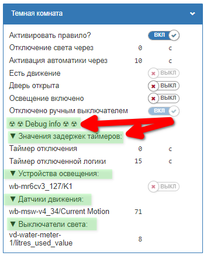
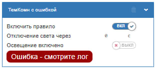

## addGroupTitleRO

Позволяет создавать топики - заголовки полезные при отладке

ВНИМАНИЕ: Их нельзя использовать в релизах - применять только при отладке!


```

var vdHelpers = require('virtual-device-helpers.mod');

...

    var titlePrefix = '▼  ';
    var titlePostfix = ':';

    vdHelpers.addGroupTitleRO(
      vDevObj,
      genNames.vDevice,
      'debugTitle',
      '☢ ☢ Debug info ☢ ☢',
      '☢ ☢ Отладочная информация ☢ ☢'
    );

    vdHelpers.addGroupTitleRO(
      vDevObj,
      genNames.vDevice,
      'timersValuesTitle',
      titlePrefix + 'Значения задержек таймеров' + titlePostfix,
      titlePrefix + 'Values of timers' + titlePostfix
    );
```

Внешний вид:



Динамическое добавление аларма к виртуальному девайсу
```
var vdHelpers = require('virtual-device-helpers.mod');

...
var vDevObj = defineVirtualDevice(...)

vdHelpers.addAlarm(
  vDevObj,
  'processErrorAlarm',
  'Ошибка - смотрите лог',
  'Error - see log'
);
```

Внешний вид:
